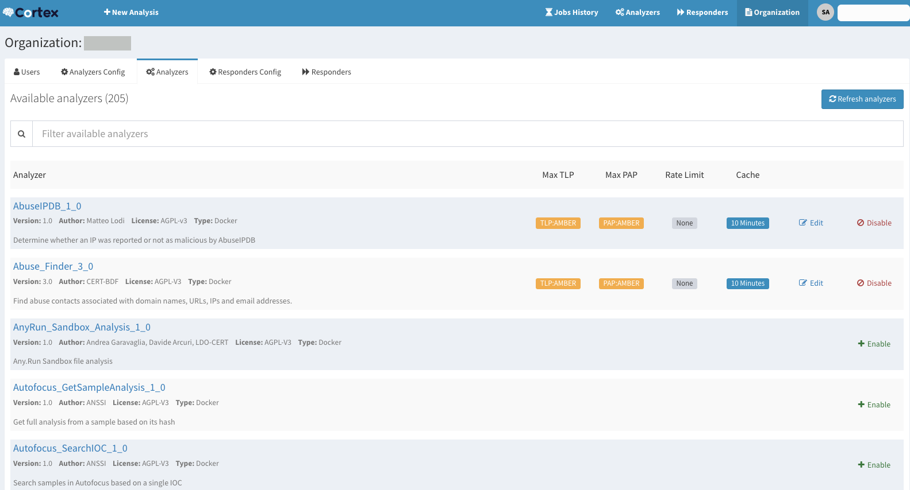

The following repository is used by [TheHive Project](https://thehive-project.org)
to develop and store [Cortex](https://github.com/TheHive-Project/Cortex/blob/master/README.md)
analyzers & responders.

Analyzers can be written in any programming language supported by Linux such 
as Python, Ruby, Perl, etc. Refer to the [How to Write and Submit an Analyzer](https://thehive-project.github.io/Cortex-Analyzers/dev_guides/how-to-create-an-analyzer/)
page for details on how to write and submit one.

To configure analyzers and responders, please refer to the detailed  [documentation](https://thehive-project.github.io/Cortex-Analyzers/).

# License

**Unless specified otherwise**, analyzers are released under the [AGPL](https://github.com/TheHive-Project/Cortex-analyzers/blob/master/LICENSE) (Affero General Public License).

If an analyzer is released by its author under a different license, the subfolder corresponding to it will contain a *LICENSE* file.

# Updates

Information, news and updates are regularly posted on [TheHive Project Twitter account](https://twitter.com/thehive_project), [StrangeBee Twitter account](https://twitter.com/strangebee) and on [the blog](https://blog.strangebee.com/).

# Contributing

We welcome your **[contributions for new analyzers](https://thehive-project.github.io/Cortex-Analyzers/dev_guides/how-to-create-an-analyzer/)**
that can take away the load off overworked fellow analysts or improvements to existing ones. Please feel free to fork the code, play with it, make some patches and send us pull requests using [issues](https://github.com/TheHive-Project/Cortex-analyzers/issues).

**Important**: To make it easy for every one, please send **one** pull request per analyzer. It will help us reviewing the code, and merging as soon as feasible.

We do have a [Code of conduct](code_of_conduct.md). Make sure to check it out before contributing.

# Security

See the [dedicated page](./SECURITY.md).

# Support

if you encounter an issue with an analyzer or would like to request a new one or an improvement to an existing analyzer, please open an issue on the [analyzers' dedicated GitHub repository](https://github.com/TheHive-Project/Cortex-Analyzers/issues/new).

Alternatively, if you need to contact the project team, send an email to <support@thehive-project.org>.

# Community Discussions

We have set up a Google forum at <https://groups.google.com/a/thehive-project.org/d/forum/users>. To request access, you need a Google account. You may create one [using a Gmail address](https://accounts.google.com/SignUp?hl=en) or [without one](https://accounts.google.com/SignUpWithoutGmail?hl=en).

Alternatively, you can join the community on [Discord](https://chat.thehive-project.org).

# Website

<https://www.strangebee.com/>
