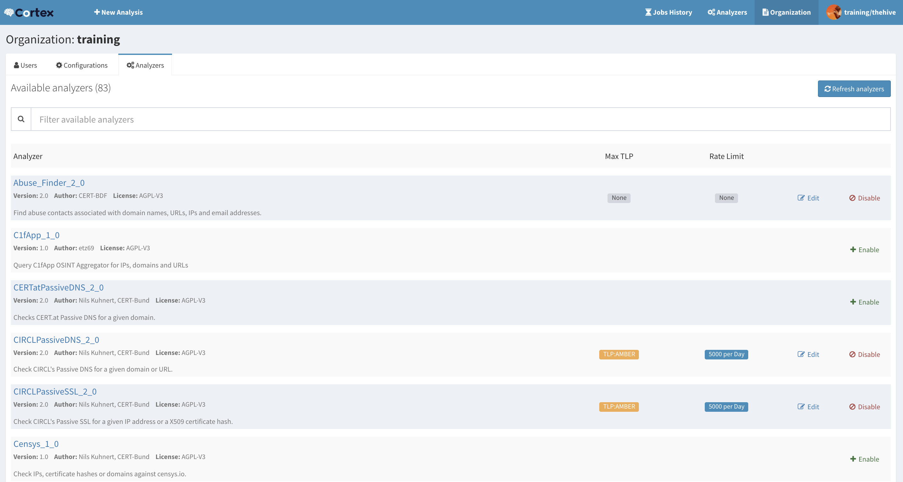

The following repository is used by [TheHive Project](https://thehive-project.org) to develop and store [Cortex](https://github.com/CERT-BDF/Cortex/blob/master/README.md) analyzers.

Analyzers can be written in any programming language supported by Linux such as Python, Ruby, Perl, etc.

For further details, please refer to the [Cortex README](https://github.com/CERT-BDF/Cortex/blob/master/README.md) or to [the project website](https://thehive-project.org).

# License
**Unless specified otherwise**, analyzers are released under the [AGPL](https://github.com/CERT-BDF/Cortex-analyzers/blob/master/LICENSE) (Affero General Public License).

If an analyzer is released by its author under a different license, the subfolder corresponding to it will contain a *LICENSE* file.

# Updates
Information, news and updates are regularly posted on [TheHive Project Twitter account](https://twitter.com/thehive_project) and on [the blog](https://blog.thehive-project.org/).

# Contributing
We welcome your contributions for new analyzers that can take away the load off overworked fellow analysts or improvements to existing ones. Please feel free to fork the code, play with it, make some patches and send us pull requests.

To make it easy for every one, please send **one** pull request per analyzer. It will help us reviewing the code, and merging as soon as feasible.

# Support
if you encounter an issue with an analyzer or would like to request a new one or an improvement to an existing analyzer, please open an issue on the [analyzers' dedicated GitHub repository](https://github.com/CERT-BDF/Cortex-Analyzers/issues/new).

Alternatively, if you need to contact the project team, send an email to <support@thehive-project.org>.

# Community Discussions
We have set up a Google forum at <https://groups.google.com/a/thehive-project.org/d/forum/users>. To request access, you need a Google account. You may create one [using a Gmail address](https://accounts.google.com/SignUp?hl=en) or [without one](https://accounts.google.com/SignUpWithoutGmail?hl=en).

# Website
<https://thehive-project.org/>
