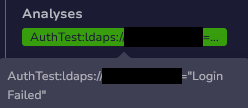
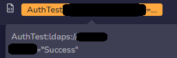

# ADCredentialChecker

Checks a credential pair against your AD

## Requirements

Cortex needs to be able to join your AD instance.

This analyzer supports 2 types of observables :

1. other
2. credential

The observable type `credential` is a custom type that you can create in TheHive

The data can be formatted as follows : `account:password` or `email:password`

## Output

The following card will be outputed to the observable in case of a failed login

he following card will be outputed to the observable in case of a successful login

