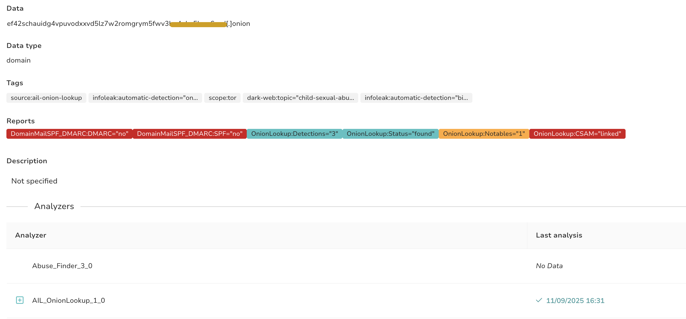
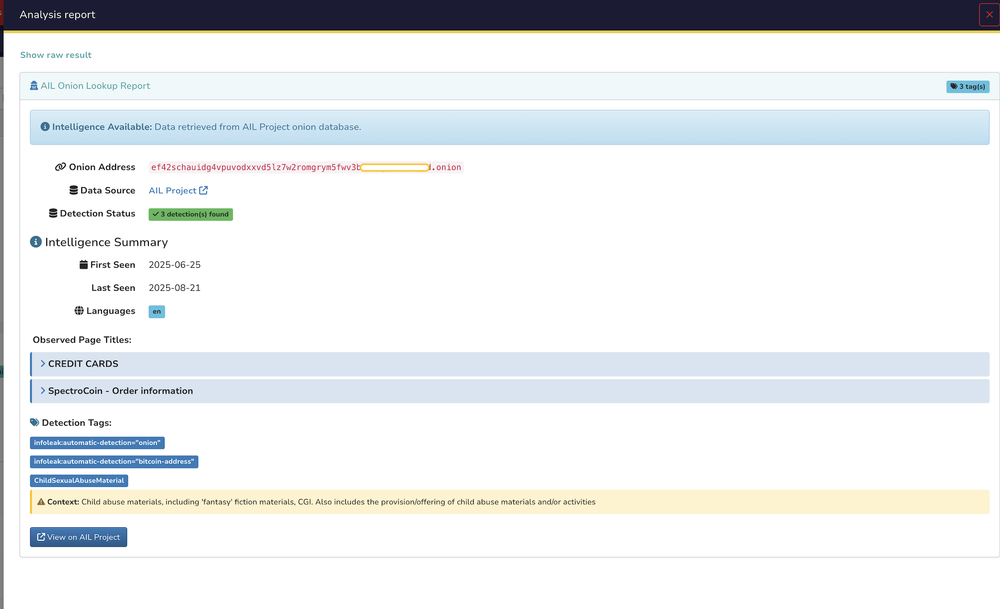

# AIL OnionLookup Analyzer

Checks the existence of Tor hidden services (.onion domains) and retrieves their associated metadata using the AIL (Analysis Information Leak) framework.

## Description

This analyzer validates and looks up onion domains through the AIL onion-lookup service to gather intelligence on dark web services. It enriches results with categorized tags based on the MISP dark-web taxonomy for law enforcement.

## Supported Data Types

- `domain` - .onion domains
- `url` - URLs containing .onion hostnames
- `fqdn` - Fully qualified domain names ending in .onion

## Configuration

| Parameter | Description | Default |
|-----------|-------------|---------|
| `base_url` | Base URL of the onion-lookup service | `https://onion.ail-project.org` |
| `timeout` | HTTP timeout in seconds | `30` |
| `verify_tls` | Verify TLS certificate | `true` |

## Output

Returns metadata about the onion service including:
- First/last seen timestamps
- Page titles and languages
- Categorized tags with descriptions
- Detection counts for security analysis

## Preview

## References

- [AIL Project](https://www.ail-project.org/)
- [MISP Dark Web Taxonomy](https://github.com/MISP/misp-taxonomies/blob/main/dark-web/machinetag.json)