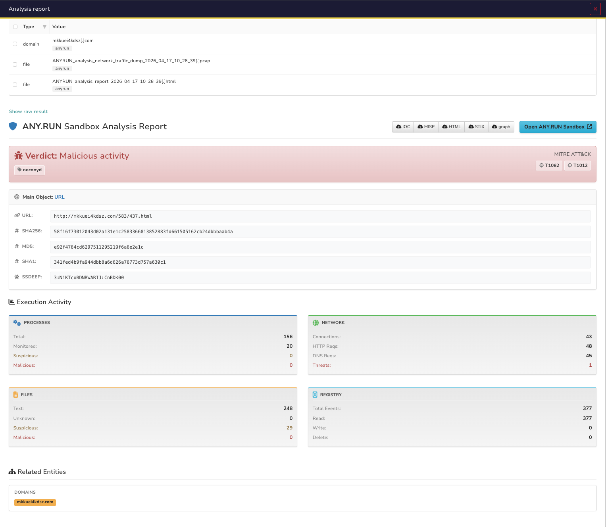
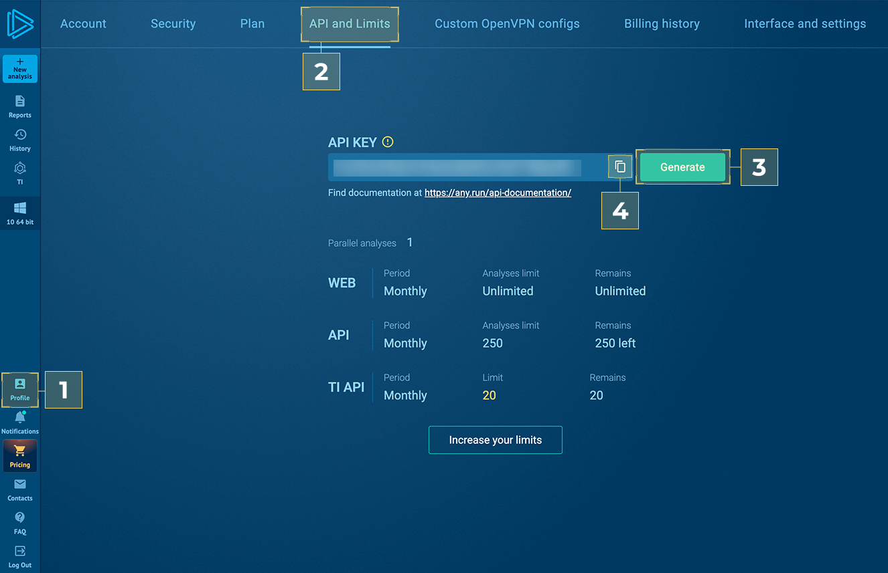
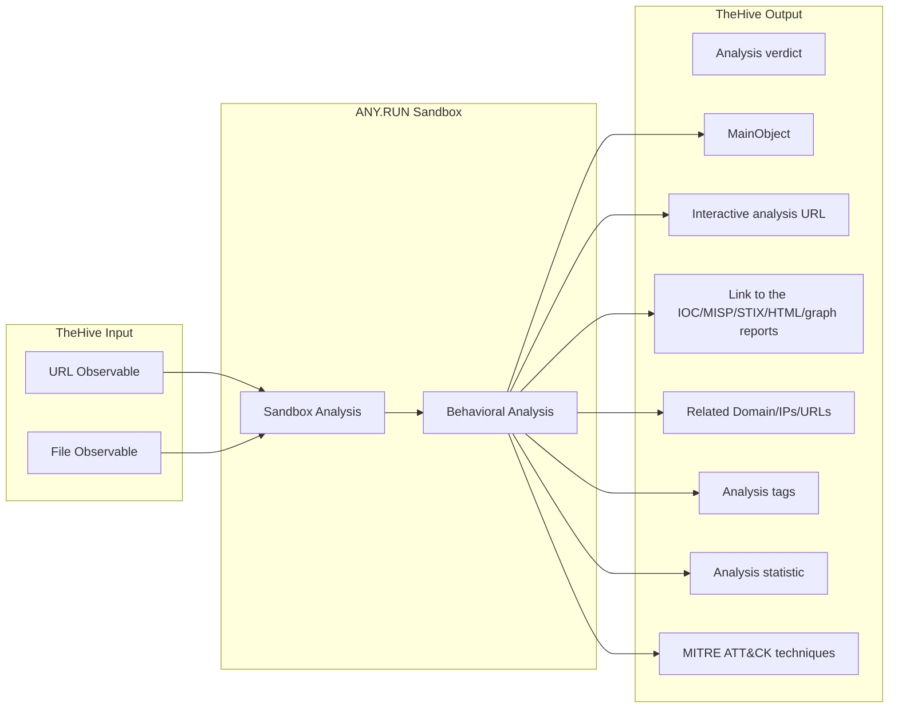
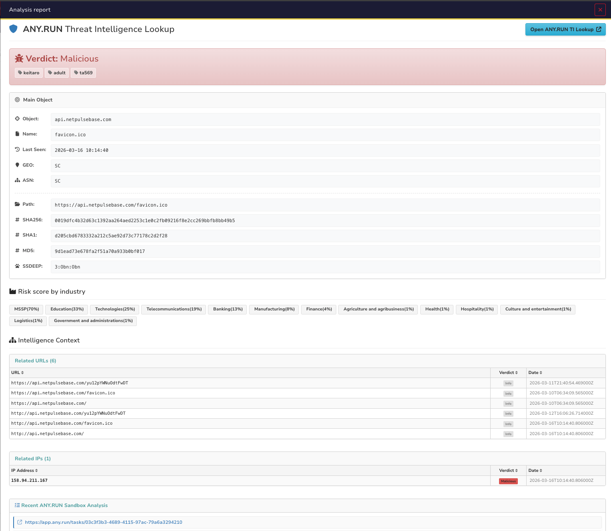
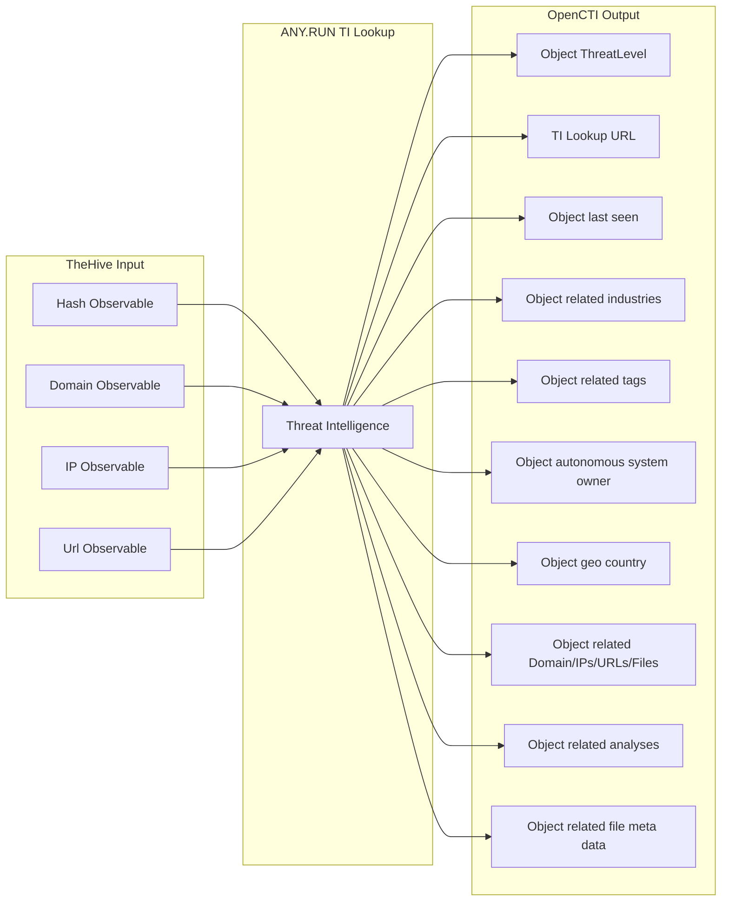

    

______________________________________________________________________

# ANY.RUN Analyzers

## Table of Contents

- [ANY.RUN Analyzers](#anyrun-analyzers)
  - [Table of Contents](#table-of-contents)
    - [ANY.RUN Sandbox Analyzers](#anyrun-sandbox-analyzers)
      - [Introduction](#introduction)
      - [Generate API-KEY](#generate-api-key)
      - [Configuration parameters](#configuration-parameters)
        - [Base ANY.RUN parameters](#base-anyrun-parameters)
        - [ANY.RUN environment parameters](#anyrun-environment-parameters)
        - [ANY.RUN Windows specific environment parameters](#anyrun-windows-specific-environment-parameters)
        - [ANY.RUN Linux specific environment parameters](#anyrun-linux-specific-environment-parameters)
        - [ANY.RUN Android specific environment parameters](#anyrun-android-specific-environment-parameters)
      - [Data flow](#data-flow)
      - [Additional information](#additional-information)
    - [ANY.RUN TI Lookup Analyzer](#anyrun-ti-lookup-analyzer)
      - [Introduction](#introduction-1)
      - [Generate API-KEY](#generate-api-key-1)
      - [Configuration parameters](#configuration-parameters-1)
        - [Base ANY.RUN parameters](#base-anyrun-parameters-1)
        - [ANY.RUN environment parameters](#anyrun-environment-parameters-1)
      - [Data flow](#data-flow-1)
      - [Additional information](#additional-information-1)
  - [Support](#support)

## ANY.RUN Sandbox Analyzers

## Introduction

[ANY.RUN's Interactive Sandbox](https://any.run/features/?utm_source=thehivegithub&utm_medium=documentation&utm_campaign=thehive_sandbox&utm_content=linktosandboxlanding) is a cloud-based service that provides SOC teams with a simple way to analyze cyber threats, enabling rapid threat intelligence and deep analysis in a secure environment.  

The connector for the Interactive Sandbox enables TheHive users to quickly analyze and identify observables, such as artifacts and URLs in the cloud sandbox. 

* Perform real-time analysis to make fast decisions
* Get detailed reports that include insights into network activity, dropped files, and MITRE ATT&CK techniques
* Enrich observables in TheHive 

As a result of the integration of ANY.RUN’s Interactive Sandbox with TheHive, you’ll achieve: 

* Streamlined Triage and Detection: Automate threat analysis to receive actionable verdicts and reports to prioritize incidents effectively.
* Shorter MTTD and MTTR: Lower response times by gaining a full understanding of the threat’s behavior in seconds.
* Higher Detection Rates: In-depth insights and advanced detection mechanisms provide deep visibility into complex threats.
* Minimized Workload: Reduce analyst workload by automating repetitive tasks.
* Stronger Security: Use sandbox reports and related data to refine rules, update playbooks, and train threat detection models. 

Report example:

## Generate API-KEY

To use this integration, make sure that you have an active [ANY.RUN Sandbox license](https://app.any.run/plans/?utm_source=thehivegithub&utm_medium=documentation&utm_campaign=thehive_sandbox&utm_content=linktopricing).

* Go to [ANY.RUN Sandbox](https://app.any.run/?utm_source=thehivegithub&utm_medium=documentation&utm_campaign=thehive_sandbox&utm_content=linktoservice)
* Click Profile > API and Limits > Generate > Copy

## Configuration parameters

There are a number of configuration options, which are set either in Cortex UI.

#### Base ANY.RUN parameters
| Parameter                    |  Mandatory | Description                                                                                  |
|------------------------------|-----------|----------------------------------------------------------------------------------------------|
| `api_key`                                      | Yes       | ANY.RUN Sandbox API-KEY. See "Generate API-KEY" section in the README file.                  |
| `verify_ssl`                                     | Yes        | Enable SSL verification option.                                                              |
| `get_html_report`                                    | Yes        | Attach HTML report to the case as observable.                                                |
| `get_network_traffic_dump`                                    | Yes        | Attach PCAP file to the case as observable.                                                  |
| `get_iocs`                                    | Yes        | Attach Analysis IOCs to the case as observables.                                             |
| `extract_malicious_iocs`                                       | Yes        | When enabled, extracts only Suspicious and Malicious IOCs. When disabled, extracts all IOCs. |

#### ANY.RUN environment parameters
| Parameter                           | Mandatory | Description                                                                                                                                                               |
|-------------------------------------|-----------|---------------------------------------------------------------------------------------------------------------------------------------------------------------------------|
| `opt_timeout`                       |  No        | Select analysis completion time. Size range: 10-660 seconds.                                                                                                              |
| `opt_network_connect`               | No        | Enable network connection.                                                                                                                                                |
| `opt_network_fakenet`               |  No        | Enable FakeNet feature.                                                                                                                                                   |
| `opt_network_tor`                   |  No        | Enable TOR using.                                                                                                                                                         |
| `opt_network_geo`                   |  No        | TOR geolocation option. Example: US, AU                                                                                                                                   |
| `opt_network_mitm`                  | No        | Enable HTTPS MITM Proxy using.                                                                                                                                            |
| `opt_network_residential_proxy`     | No        | Residential proxy using.                                                                                                                                                  |
| `opt_network_residential_proxy_geo` |  No        | Residential proxy geolocation option. Example: US, AU.                                                                                                                    |
| `opt_privacy_type`                  |  No        | Privacy settings. Supports: public, bylink, owner, byteam.                                                                                                                |
| `opt_auto_delete_after`             |  No        | Specify after what period of time this report should be deleted. Supports: day, week, 2 weeks, month. Leave blank for the task's infinite lifetime.                       |
| `obj_ext_extension`                 |  No        | Automatically change file extension to valid.                                                                                                                             |
| `env_locale`                        |  No        | Operation system's language. Use locale identifier or country name (Ex: "en-US" or "Brazil"). Case-insensitive.                                                           |
| `user_tags`                         |  No        | Append User Tags to new analysis. Only characters a-z, A-Z, 0-9, hyphen (-), and comma (,) are allowed. Max tag length - 16 characters. Max unique tags per analysis - 8. |

#### ANY.RUN Windows specific environment parameters
| Parameter             |  Mandatory | Description                                                                                                                           |
|-----------------------|------------|---------------------------------------------------------------------------------------------------------------------------------------|
| `env_version`         |  No       | Version of OS. Supports: 7, 10, 11, server 2025                                                                                       |
| `env_bitness`         |  No       | Bitness of Operation System. Supports 32, 64.                                                                                         |
| `env_type`            |  No       | Environment preset type. You can select **development** env for OS Windows 10 x64. For all other cases, **complete** env is required. |
| `obj_ext_startfolder` |  No       | Supports: desktop, home, downloads, appdata, temp, windows, root.                                                                     |
| `obj_ext_cmd`         |  No       | Optional command-line arguments for the analyzed object. Use an empty string ("") to apply the default behavior.                      |
| `obj_force_elevation` |  No       | Forces the file to execute with elevated privileges and an elevated token (for PE32, PE32+, PE64 files only).                         |                     
| `obj_ext_browser`     |  No       | Browser name. Supports: Google Chrome, Mozilla Firefox, Internet Explorer, Microsoft Edge.                                            |
| `auto_confirm_uac`    |  No       | Auto confirm Windows UAC requests.                                            |

#### ANY.RUN Linux specific environment parameters
| Parameter             | Mandatory | Description                                             |
|-----------------------|------------|---------------------------------------------------------|
| `env_os`              | No        |Operation System. Supports ubuntu, debian| 
| `obj_ext_startfolder` |  No        | Start object from. Supports: desktop, home, downloads, temp.                                       |
| `obj_ext_cmd`         |  No        | Optional command-line arguments for the analyzed object. Use an empty string ("") to apply the default behavior. |
| `run_as_root`         |  No        | Run file with superuser privileges.                     |                     
| `obj_ext_browser`     |  No        | Browser name. Supports: Google Chrome, Mozilla Firefox. |

#### ANY.RUN Android specific environment parameters
| Parameter                    | Mandatory | Description                                                                                                  |
|------------------------------|-----------|--------------------------------------------------------------------------------------------------------------|
| `obj_ext_cmd`             |  No       | Optional command-line arguments for the analyzed object. Use an empty string ("") to apply the default behavior. |

### Data Flow

## Additional information

- **Analysis Time**: Sandbox analysis typically takes 1-3 minutes depending on the sample
- **Task Timer**: Configure `anyrun_opt_timeout` based on expected analysis time
- **Privacy Settings**: Use `bylink` or `team` for sensitive samples
- **API Access Required**: Available on ANY.RUN plans with API access, including trial
- **Rate Limits**: API calls are subject to ANY.RUN rate limits based on subscription tier

## ANY.RUN TI Lookup Analyzer

## Introduction

ANY.RUN’s [Threat Intelligence Lookup](https://any.run/threat-intelligence-lookup/?utm_source=thehivegithub&utm_medium=documentation&utm_campaign=thehive_lookup&utm_content=linktolookuplanding) (TI Lookup) is a service that allows you to browse IOCs and related threat data to simplify and enrich cyberattack investigations. 

The Threat Intelligence Lookup сonnector enables TheHive users to browse various types of IOCs, from IPs and domains to URLs and hashes. 

* Browse indicators in TI Lookup without leaving TheHive
* Receive data related to your query to gain actionable insights
* Use them for incident response, to create new rules, train models, update playbooks, etc. 

As a result of integration of TI Lookup with TheHive, you’ll achieve: 

* Early Threat Detection: Correlate IOCs to identify incidents before they escalate.
* Proactive Defense Enrichment: Collect indicators from attacks on other companies to update your detection systems.
* Reduced MTTR and Increased Detection Rate: Access to rich threat context enables SOCs to make informed decisions fast.

Report example:

## Generate API-KEY

To use this integration, make sure that you have an active [ANY.RUN Sandbox license](https://app.any.run/plans/?utm_source=thehivegithub&utm_medium=documentation&utm_campaign=thehive_sandbox&utm_content=linktopricing).

* Go to [ANY.RUN Sandbox](https://app.any.run/?utm_source=thehivegithub&utm_medium=documentation&utm_campaign=thehive_sandbox&utm_content=linktoservice)
* Click Profile > API and Limits > Generate > Copy

## Configuration parameters

There are a number of configuration options, which are set either in Cortex UI.

#### Base ANY.RUN parameters
| Parameter                    |  Mandatory | Description                                                                                  |
|------------------------------|-----------|----------------------------------------------------------------------------------------------|
| `api_key`                                      | Yes       | ANY.RUN Sandbox API-KEY. See "Generate API-KEY" section in the README file.                  |
| `verify_ssl`                                     | Yes        | Enable SSL verification option.                                                              |
| `get_iocs`                                    | Yes        | Attach Analysis IOCs to the case as observables.                                             |
| `extract_malicious_iocs`                                       | Yes        | When enabled, extracts only Suspicious and Malicious IOCs. When disabled, extracts all IOCs. |

#### ANY.RUN environment parameters
| Parameter                           | Mandatory | Description                                                                                                                                                               |
|-------------------------------------|-----------|---------------------------------------------------------------------------------------------------------------------------------------------------------------------------|
| `lookup_depth`                       |  No        | Specify the number of days from the current date for which you want to lookup.                                                                                                              |

### Data Flow

## Additional information

- **API Access Required**: Available on ANY.RUN plans with API access, including trial
- **Rate Limits**: API calls are subject to ANY.RUN rate limits based on subscription tier

## Support

This is an ANY.RUN’s supported connector. You can write to us for help with integration via [techsupport@any.run](mailto:techsupport@any.run) .
Contact us for a quote or demo via [this form](https://app.any.run/contact-us/?utm_source=thehivegithub&utm_medium=documentation&utm_campaign=thehive_sandbox&utm_content=linktocontactus). 
