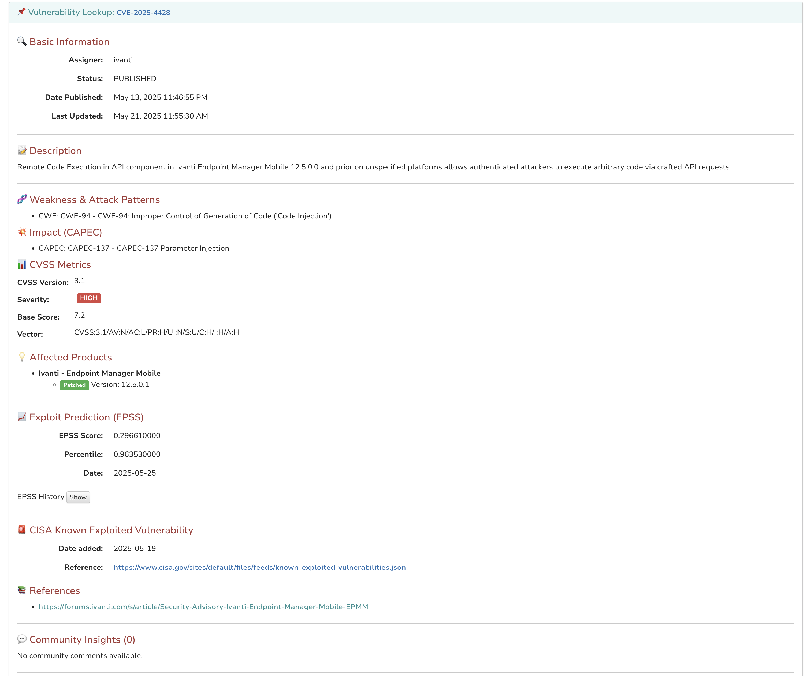

### CIRCL Vulnerability Lookup Analyzer

Queries the CIRCL Vulnerability Lookup API to retrieve detailed information on security vulnerabilities, including CVEs, severity (CVSS), exploit prediction (EPSS), affected products, advisories, and recent sightings.

#### Configuration

Set the `url` of the CIRCL Vulnerability Lookup API (pre-filled) and your API `token` in the analyzer’s configuration in Cortex.

#### Usage

Run the analyzer on a CVE or vulnerability observable. The analyzer will fetch and display comprehensive vulnerability details directly in TheHive.

##### Requirements

- valid API token from [CIRCL Vulnerability Lookup](https://vulnerability.circl.lu/).

#### Preview

##### Short report

##### Long report

