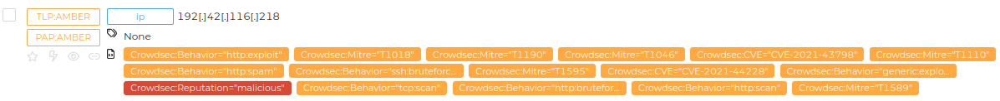

### CrowdSec

Check [CrowdSec](https://www.crowdsec.net/) Threat Intelligence about an ip address.

Running the analyzer will expose the result as taxonomies in the short report displayed in the ip observable.



The raw report contains the whole json response from CrowdSec.

e.g.:

```javascript
{
  "ip_range_score": 0,
  "ip": "223.171.256.256",
  "ip_range": "223.171.0.0/16",
  "as_name": "LGTELECOM",
  "as_num": 17853,
  "location": {
    "country": "KR",
    "city": null,
    "latitude": 42,
    "longitude": 42
  },
  "reverse_dns": null,
  "behaviors": [
    {
      "name": "pop3/imap:bruteforce",
      "label": "POP3/IMAP Bruteforce",
      "description": "IP has been reported for performing a POP3/IMAP brute force attack."
    }
  ],
  "history": {
    "first_seen": "2022-09-26T03:45:00+00:00",
    "last_seen": "2022-10-11T08:15:00+00:00",
    "full_age": 16,
    "days_age": 15
  },
  "classifications": {
    "false_positives": [],
    "classifications": []
  },
  "attack_details": [
    {
      "name": "crowdsecurity/postfix-spam",
      "label": "Postfix Bruteforce",
      "description": "Detect spammers/postfix brute force",
      "references": []
    }
  ],
  "target_countries": {
    "DE": 25,
    "FR": 25,
    "PL": 25,
    "SK": 25
  },
  "scores": {
    "overall": {
      "aggressiveness": 0,
      "threat": 4,
      "trust": 0,
      "anomaly": 1,
      "total": 1
    },
    "last_day": {
      "aggressiveness": 0,
      "threat": 0,
      "trust": 0,
      "anomaly": 1,
      "total": 0
    },
    "last_week": {
      "aggressiveness": 0,
      "threat": 4,
      "trust": 0,
      "anomaly": 1,
      "total": 1
    },
    "last_month": {
      "aggressiveness": 0,
      "threat": 4,
      "trust": 0,
      "anomaly": 1,
      "total": 1
    }
  },
  "references": []
}
```


#### Requirements

Provide a [CrowdSec CTI Api key](https://www.crowdsec.net/product/threat-intelligence#card-four)
as a value for the `api_key` parameter.
