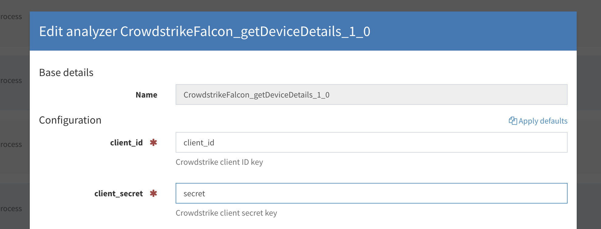
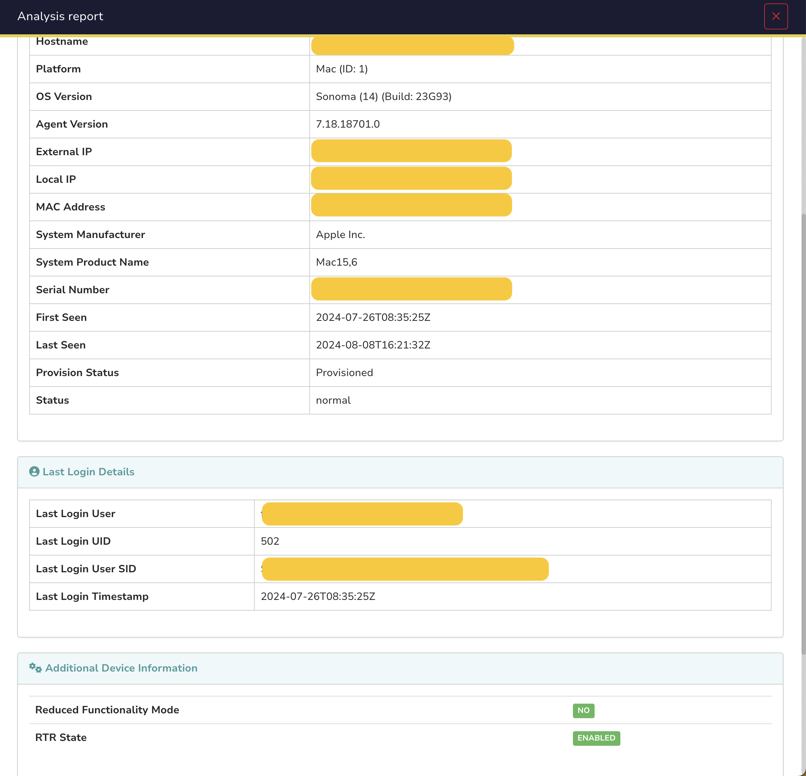
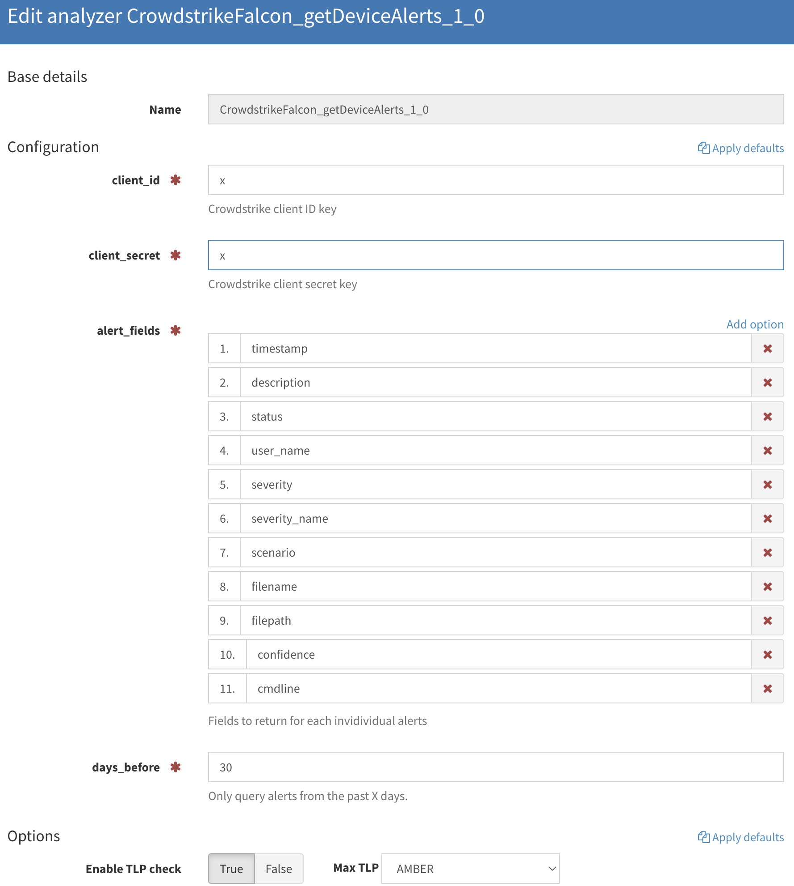
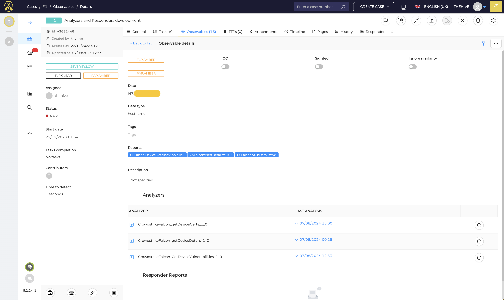
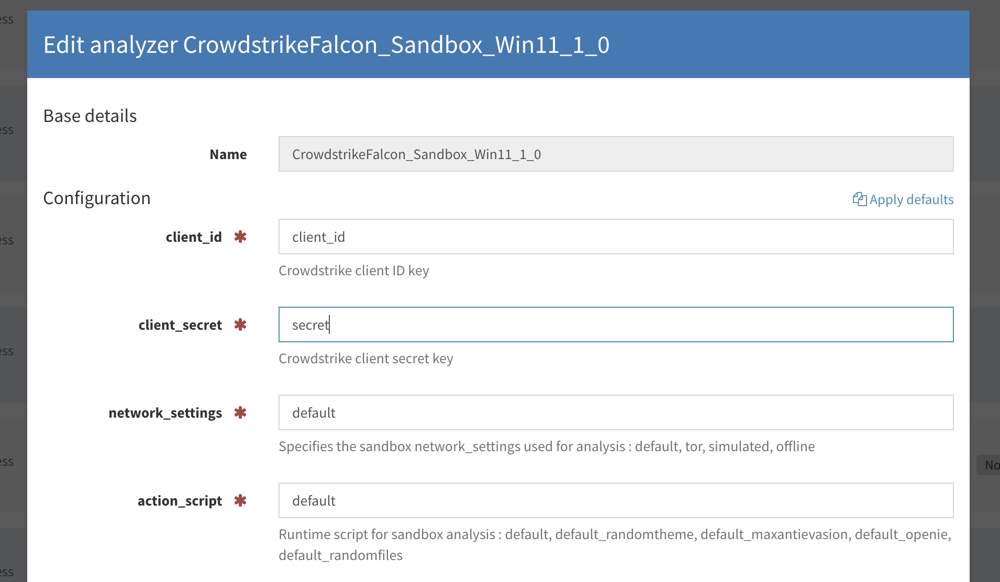

# CrowdStrike Falcon Analyzers

This documentation covers the setup and usage of CrowdStrike Falcon analyzers for retrieving **device information**, **vulnerabilities** and **alerts** linked to a given **hostname** observable, as well as performing **file** analysis using the CrowdStrike Falcon Sandbox.

---

## Pre-requisites

To use these analyzers, you must have the following configured in your CrowdStrike Falcon tenant:

1. **CrowdStrike Falcon Setup**:
   - Log in to your CrowdStrike Falcon tenant.
   - Navigate to **Support and resources > Resources and tools > API clients and keys**.
   - Create an **API Client** with the required permissions:
     - **Hosts**: Read (for `getDeviceDetails` and `getDeviceVulnerabilities`).
     - **Vulnerabilities**: Read (for `getDeviceVulnerabilities`).
     - **Alerts**: Read (for `getDeviceAlerts`).
     - **Sandbox (Falcon Intelligence)**: Read, Write (for `Falcon Sandbox`).

---

## Analyzers Overview

### 1. **getDeviceDetails Analyzer**

- **Description**: Retrieves and displays detailed **device information** based on a given hostname observable.
- **Permissions Required**: `Hosts: Read`

#### **Available Configuration**

#### **Short Report**
Displays basic details such as:
- Vendor
- OS version
- Agent status
- Last user logged in

#### **Long Report**
Provides detailed information about the device.

---

### 2. **getDeviceVulnerabilities Analyzer**

- **Description**: Retrieves and displays **vulnerabilities** linked to a hostname observable.
- **Permissions Required**: `Hosts: Read`, `Vulnerabilities: Read`

#### **Available Configuration**

#### **Short Report**
Displays the number of vulnerabilities linked to the hostname.

#### **Long Report**
Provides a detailed list of vulnerabilities with contextual information.

---

### 3. **getDeviceAlerts Analyzer**

- **Description**: Retrieves and displays **alerts** linked to a hostname observable for the past **X** days.
- **Permissions Required**: `Alerts: Read`

#### **Available Configuration**

#### **Short Report**
Displays the number of alerts linked to the hostname.

#### **Long Report**
Provides a detailed list of alerts with contextual information.

---

### 4. **Falcon Sandbox Analyzer**

- **Description**: Sends a **file** observable to the CrowdStrike Falcon Sandbox for analysis. Once the analysis is complete, the results are displayed in a report.
- **Permissions Required**: `Sandbox (Falcon Intelligence): Read, Write`

#### **Available Configuration**
- List of analyzers:  
  

- Configuration interface:  
  

#### **Short Report**
Displays whether the analyzed file is considered:
- **Safe** (green)
- **Suspicious** (orange)
- **Malicious** (red)

#### **Long Report**
Provides a detailed analysis of the file.

---

## Resources

For more information on the relevant CrowdStrike Falcon APIs, refer to the following resources:
- [CrowdStrike Falcon Hosts API](https://www.falconpy.io/Service-Collections/Hosts.html)
- [CrowdStrike Falcon Vulnerabilities API](https://www.falconpy.io/Service-Collections/Spotlight-Vulnerabilities.html)
- [CrowdStrike Falcon Alerts API](https://www.falconpy.io/Service-Collections/Alerts.html)
- [CrowdStrike Falcon Sample Uploads API](https://www.falconpy.io/Service-Collections/Sample-Uploads.html)
- [CrowdStrike Falcon Sandbox API](https://www.falconpy.io/Service-Collections/Falconx-Sandbox.html)
