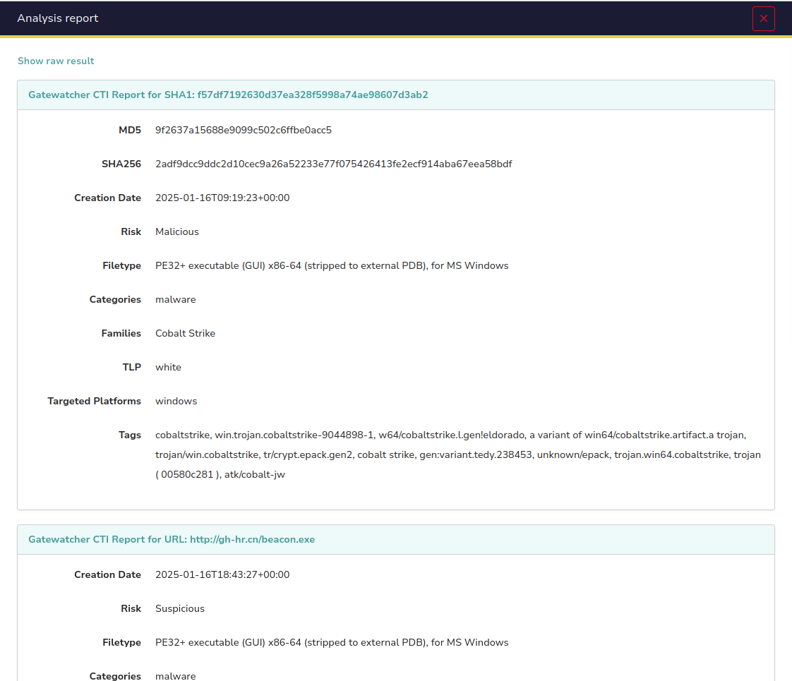
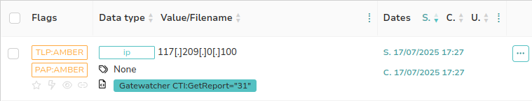
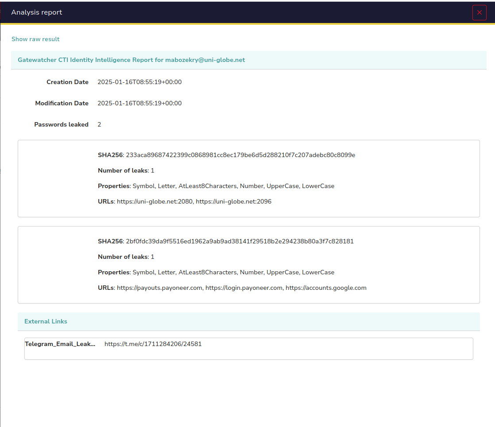

## Gatewatcher
Gatewatcher is a European leader in advanced Threats detection, protecting critical networks of large Entreprises and Governement organisations since 2015.

## Gatewatcher CTI
The Gatewatcher CTI (Cyber Threat Intelligence) offer is compatible with all cybersecurity solutions. It immediately enhances your detection with contextual information about internal and external cyber threats specifically targeting your business.

## How to obtain credentials ?
If you want to try our freemium offer your can obtain your API key : https://info.gatewatcher.com/en/lp-free-ioc-analysis-api-key

# How the analyzer works ?
Gatewatcher CTI analyzer allows you to get information about hashes,urls,domains,fqdn,ips or emails.
- To enable Gatewatcher_CTI analyzer:
    - Navigate to "Organization" -> "Analyzers"
    - Refresh analyzers to ensure that you have the lastest version.
    - Search for "Gatewatcher_CTI".
    - Enable it and configure its parameters (LIS API key is required).

## Run on hashes/urls/domains/fqdns
Search for an Indicator of Compromise (IoC: url, host/domain, hash) or vulnerability in the Gatewatcher CTI database.

- Short report

- Long report

## Run on IPs
Retrieves metadata, security threat alerts, and a contextualized timeline of events associated with a specific IP address from the Gatewatcher CTI database.

- Short report

- Long report

## Run on emails
Get all contextual informations (hash of password, url of connection...) for a targeted email address from the Gatewatcher CTI database.

-  Short report

- Long report

