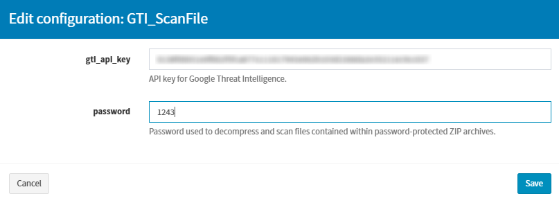
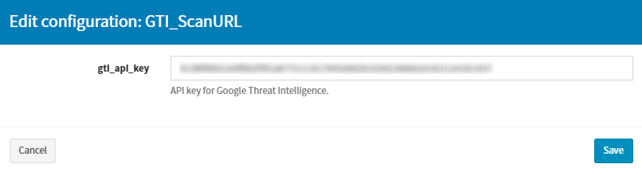
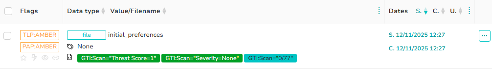
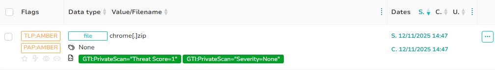

# Google Threat Intelligence App for TheHive

## Overview
Google Threat Intelligence (GTI) combines Mandiant’s frontline expertise, Google’s extensive data resources, and VirusTotal’s crowdsourced intelligence to deliver real-time, contextual threat insights including reputation data for files, hashes, domains, IPs, and URLs, as well as detailed static and dynamic analysis. The Google Threat Intelligence App for TheHive brings this rich intelligence directly into the investigation workflow, enabling analysts to manually enrich observables with severity assessments, relationships, MITRE ATT&CK mappings, sandbox behaviour, and historical activity drawn from Google’s global threat ecosystem. By eliminating the need for external lookups and providing immediate, high-value context for indicators of compromise, the integration streamlines investigations, reduces operational overhead, and empowers security teams to shift from reactive triage to proactive, intelligence-driven defence, ultimately strengthening overall security posture.

## Key Features

* **IOC Enrichment:** Retrieve the latest Google Threat Intelligence report for any observable—including files, hashes, URLs, domains, and IP addresses providing immediate context and threat assessment.
* **Public File Analysis:** Fetch detailed intelligence for files that have been publicly submitted to Google Threat Intelligence for analysis, including behavioural insights and verdicts.
* **Private File Analysis:** Obtain the latest intelligence report for files submitted privately, ensuring sensitive samples are analyzed securely without public exposure.
* **Public URL Analysis:** Access comprehensive intelligence for URLs that have been publicly scanned by Google Threat Intelligence, including categorization, risk assessment, and related threat indicators.
* **Private URL Analysis:** Retrieve intelligence reports for URLs scanned privately, enabling secure investigation of internal or sensitive links without sharing them publicly.

## Prerequisites

To use this integration, you will need:

* A valid **Google Threat Intelligence (GTI) API Key**.

## Analyzer Configuration (in Cortex)

Configure the analyzers within the Cortex interface. A dedicated configuration page is available for the Google Threat Intelligence integration.

> **Important Note:** In Cortex, password or API key fields are shown as plain text. They are not hidden with dots or asterisks.

### 1. GTI_GetIOCReport
Get the latest Google Threat Intelligence report for a file, hash, url, domain or an IP address.

* **gti_api_key**: Paste your GTI API key here.

### 2. GTI_ScanFile
Get the latest Google Threat Intelligence report for a file that was submitted for public scanning.

* **gti_api_key**: Paste your GTI API key here.
* **password**: (Optional) Default password to decompress and scan a file contained in a protected ZIP file. This can be overridden per job.

### 3. GTI_ScanPrivateFile
Get the latest Google Threat Intelligence report for a file that was submitted for private scanning. This analyzer provides additional privacy and sandbox controls.

* **gti_api_key**: Paste your GTI API key here.
* **password**: (Optional) Default password to decompress a protected ZIP file. Can be overridden per job.
* **command_line**: (Optional) Command line arguments to use when running the file in sandboxes.
* **disable_sandbox**: (Optional) Set to `true` to skip sandbox detonation for sensitive or non-executable files.
* **enable_internet**: (Optional) Set to `true` if the file should have internet access when running in sandboxes.
* **retention_period_days**: (Optional) Number of days the report and file are kept (between 1 and 28). Defaults to the group's retention policy.
* **interaction_sandbox**: (Optional) Select the sandbox for interactive use.
    * **Allowed:** `cape_win`, `cape_linux`
* **interaction_timeout**: (Optional) Interaction timeout in seconds.
    * **Min:** `60` (1 minute)
    * **Max:** `1800` (30 minutes)
* **locale**: (Optional) Preferred sandbox locale to match the file's expected environment.
    * **Allowed:** `EN_US`, `AR_SA`, `DE_DE`, `ES_ES`, `PT_BR`
* **storage_region**: (Optional) Storage region for the file, based on data residency requirements. Defaults to the group's preference.
    * **Allowed:** `US`, `CA`, `EU`, `GB`

### 4. GTI_ScanURL
Get the latest Google Threat Intelligence report for a URL that was submitted for public scanning.

* **gti_api_key**: Paste your GTI API key here.

### 5. GTI_ScanPrivateURL
Get the latest Google Threat Intelligence report for a URL that was submitted for private scanning. This analyzer provides additional privacy and sandbox controls.

* **gti_api_key**: Paste your GTI API key here.
* **user_agent**: (Optional) Specify a custom user agent string for the scan.
* **sandboxes**: (Optional) Comma-separated list of sandboxes for analysis.
    * **Possible values:** `chrome_headless_linux`, `cape_win`, `zenbox_windows`
* **retention_period_days**: (Optional) Number of days the report and URL are kept (between 1 and 28). Defaults to the group's retention policy.
* **storage_region**: (Optional) Storage region for the URL, based on data residency requirements. Defaults to the group's preference.
    * **Allowed:** `US`, `CA`, `EU`, `GB`
* **interaction_timeout**: (Optional) Interaction timeout in seconds.
    * **Min:** `60` (1 minute)
    * **Max:** `1800` (30 minutes)

## Using the Analyzers in TheHive

All analyzers are executed manually from an observable within a TheHive case.

### How to Run an Analyzer
1. Open a case in TheHive and navigate to the Observables tab.
2. Locate the target observable you wish to analyze.
3. Click the three-dot (⋮) menu on the observable row and select "Run analyzers".
4. In the sidebar that appears, find and select the desired GTI_ analyzer from the list.
5. Click the Run Selected Analyzers button.
6. Wait for the job to complete in Cortex (the observable's analyzer list will update).

### Analyzer Report Details

#### 1. GTI_GetIOCReport (Enrich IOC)
* **Use Case**: Get the latest Google Threat Intelligence report for a file, hash, url, domain or an IP address.
* **Report Summary**: 

* **Full Report Content:** 
    * **Extracted Observables:** Related IOCs discovered during analysis, which can be imported directly into the case.
    * **IOC Summary:** High-level details about the observable and its attributes.
    * **GTI Assessment:** Shows the verdict, severity, threat score, and other risk indicators for the IOC.
    * **Threat Severity:** Indicates the threat level and classification based on GTI’s evaluation.
    * **HTTPS Certificate:** Associated certificate information (if available).
    * **Scan Result:** Scan details, verdicts, and detection outcomes.
    * **Relationships:** Linked collections, threat actors, malware families, software toolkits, campaigns, reports, vulnerabilities, and other related IOCs.
    * **MITRE ATT&CK Report:** Relevant adversarial tactics and techniques associated with the observable.
    * [See Full Report](assets/get_ioc_report_full_report.png)

#### 2. GTI_ScanFile (Public File Scan)
* **Use Case**: Get the latest Google Threat Intelligence report for a file that was submitted to Google Threat Intelligence for scanning.
* **Report Summary**: 

* **Full Report Content:**  
    * **Extracted Observables:** Related IOCs discovered during analysis, which can be imported directly into the case.
    * **File Summary:** Core metadata and analysis details about the file.  
    * **GTI Assessment:** Shows the verdict, severity, threat score, and other risk indicators for the file.  
    * **Threat Severity:** Indicates the threat level and classification based on GTI’s evaluation.  
    * **HTTPS Certificate:** Associated certificate information (if available).  
    * **Scan Result:** Scan details, verdicts, and detection outcomes.  
    * **Relationships:** Linked collections, threat actors, malware families, software toolkits, campaigns, reports, vulnerabilities, and other related IOCs.  
    * **MITRE ATT&CK Report:** Relevant adversarial tactics and techniques associated with the observable.  
    * [See Full Report](assets/scan_file_full_report.png)

#### 3. GTI_ScanPrivateFile (Private File Scan)
* **Use Case**: Get the latest Google Threat Intelligence report for a file that was privately submitted to Google Threat Intelligence for scanning.
* **Report Summary**: 

* **Full Report Content:**  
    * **File Summary:** Displays the file’s metadata and core characteristics.  
    * **GTI Assessment:** Shows the verdict, severity, threat score, and other risk indicators for the file.  
    * **Threat Severity Details:** Indicates the threat level and classification based on GTI’s evaluation.  
    * **File Hashes:** Lists all available file hashes, including MD5, SHA1, and SHA256.  
    * **File Properties:** Displays the file’s known names, tags, and classification properties.  
    * **Archive Contents:** If the uploaded file is an archive (e.g., ZIP), this section provides details such as archive type, number of files, and other relevant information.   
    * [See Full Report](assets/scan_private_file_full_report.png)

#### 4. GTI_ScanURL (Public URL Scan)
* **Use Case**: Get the latest Google Threat Intelligence report for a URL that was submitted to Google Threat Intelligence for scanning.
* **Report Summary**: 

* **Full Report Content:**  
    * **Extracted Observables:** Related IOCs discovered during analysis, which can be imported directly into the case.
    * **URL Summary:** Core metadata and analysis details about the URL.  
    * **GTI Assessment:** Contextual analysis derived from Google’s threat intelligence database.  
    * **Threat Severity:** Risk or severity rating associated with the observable.  
    * **HTTPS Certificate:** Associated certificate information (if available).  
    * **Scan Result:** Scan details, verdicts, and detection outcomes.  
    * **Relationships:** Linked collections, threat actors, malware families, software toolkits, campaigns, reports, vulnerabilities, and other related IOCs.     
    * [See Full Report](assets/scan_url_full_report.png)

#### 5. GTI_ScanPrivateURL (Private URL Scan)
* **Use Case**: Get the latest Google Threat Intelligence report for a URL that was privately submitted to Google Threat Intelligence for scanning.
* **Report Summary**: 

* **Full Report Content:**  
    * **URL Summary:** Displays key attributes and metadata of the analyzed URL.  
    * **GTI Assessment:** Shows the verdict, severity, threat score, and other risk indicators for the URL.  
    * **URL Analysis:** Provides insights into URL tags, redirection chain, and outgoing links.  
    * **HTTP Headers:** Displays information about HTTP request and response headers.  
    * **Content Analysis:** Shows analyzed URL content, including page structure and identified threat patterns.      
    * [See Full Report](assets/scan_private_url_full_report.png)

## Troubleshooting
* **Authentication Failed Error**: This almost always indicates an invalid or expired GTI API Key. Verify your key in the Cortex analyzer configuration and ensure it has the correct permissions in your Google Cloud project.
* **Jobs Fail Immediately**: Ensure the Cortex instance has network connectivity to the Google Threat Intelligence API endpoints. Check for any intervening firewalls or proxies.
* **Analyzer Not Found in TheHive**: This means the analyzer is not enabled or properly configured in the linked Cortex instance. Log in to Cortex, enable the GoogleThreatIntelligence analyzers, and add your API key.
* **File/URL Scan Timeouts**: Private scans, especially with sandbox interaction, can take several minutes. If jobs consistently time out, check the job logs in Cortex for more detailed error messages.
