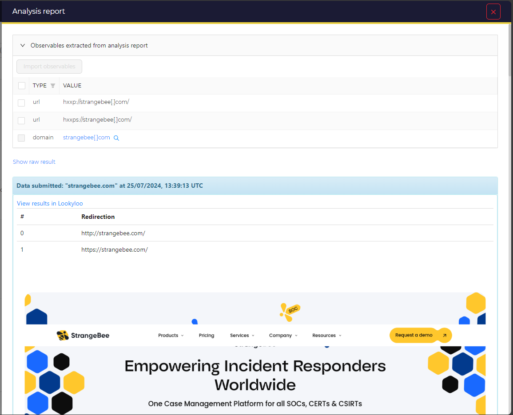
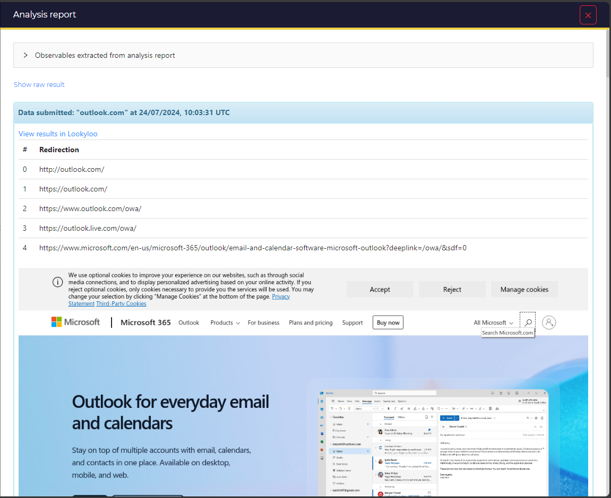

# Lookyloo

Lookyloo is a tool that resolve http URLs. It show redirections and take a screenshot of a website without directly accessing it.
This analyzer can be configured to use any open Lookyloo instances. It does not manage Lookyloo instances protected by user-password and API key.
By default, it use the instance of the CIRCL: https://lookyloo.circl.lu/

Input data:
- URL
- Domain

Lookyloo project: https://github.com/Lookyloo/lookyloo

## Requirements

This analyzer requires 2 python modules:
- cortexutils
- pylookyloo

`pip install -r requirements.txt`

## Screenshots

