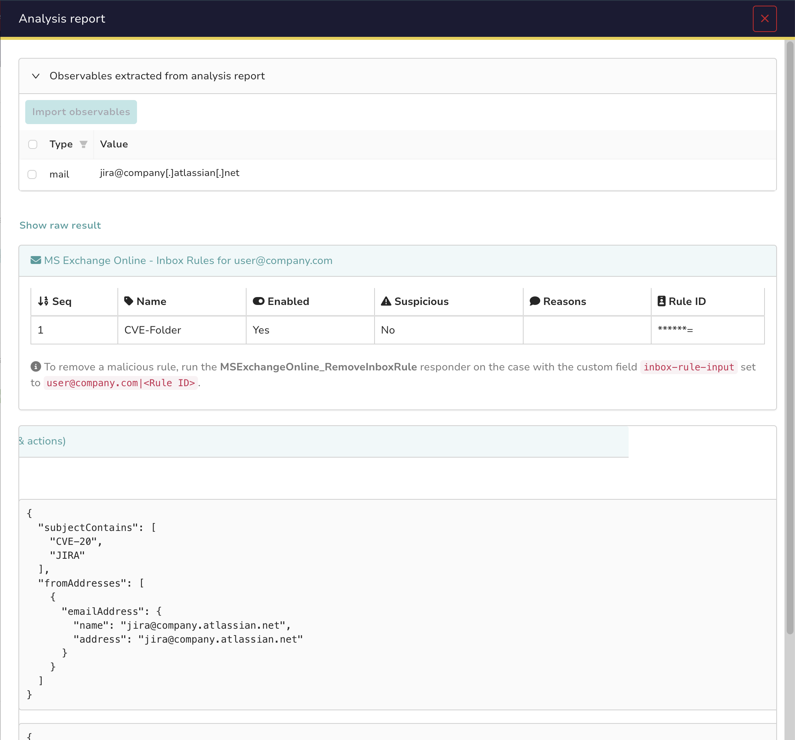

# Microsoft Exchange Online Analyzer

This **Cortex** analyzer enriches your investigations in TheHive with mailbox data from **Exchange Online**, using the **Microsoft Graph API** (the method recommended by Microsoft, since Exchange Web Services (EWS) is deprecated and will be blocked for non-Microsoft apps starting **October 1, 2026**).

It requires a Microsoft Entra ID **app registration** (client ID + secret) with **admin-consented application permissions**.

---

## Table of Contents

1. [Overview](#overview)
2. [Global Configuration](#global-configuration)
3. [Setup: Create the Entra ID Credentials](#setup-create-the-entra-id-credentials)
    - [Prereqs](#prereqs)
    - [1. App Registration](#1-app-registration)
    - [2. Client Secret](#2-client-secret)
    - [3. API Permissions](#3-api-permissions)
4. [Analyzers](#analyzers)
    - [getInboxRules](#getinboxrules)
5. [Related Responder](#related-responder)
6. [References](#references)

---

## Overview

This analyzer helps investigate Business Email Compromise (BEC) cases. It lists the inbox rules of a mailbox and flags the ones matching patterns typically seen after a mailbox compromise:

- forwarding or redirecting mail to an external domain
- rules with no conditions that delete or move all incoming mail
- rules filtering security-related keywords (phish, hack, password...) that hide, delete or forward the matching mail
- rules filtering financial keywords (invoice, payment, wire, ACH...) that delete, forward or hide the matching mail (a simple move to a regular folder is not flagged)
- rules moving mail to folders used to hide messages (RSS Feeds, Conversation History, Deleted Items...)
- rules with obfuscated names (empty, punctuation only, repeated characters)

---

## Global Configuration

All flavors share these config fields:

- **`tenant_id`**: Microsoft Entra ID Tenant ID
- **`client_id`**: Application (client) ID of your Entra ID app registration
- **`client_secret`**: Client secret generated for that app
- **`extended_search`** (optional, default `true`): also match users by `onPremisesSamAccountName` and `employeeId` in addition to UPN and mail

Authentication uses the **OAuth 2.0 client credentials flow** against `https://login.microsoftonline.com/{tenant_id}/oauth2/v2.0/token` with the `https://graph.microsoft.com/.default` scope.

---

## Setup: Create the Entra ID Credentials

### Prereqs

- A user account with at least the **Cloud Application Administrator** role to create and manage app registrations.
- A user account with the **Global Administrator** role (or **Privileged Role Administrator**) to grant admin consent to the required API permissions.

### 1. App Registration

1. Navigate to the [Microsoft Entra admin center](https://entra.microsoft.com/) and sign in with an administrator account.
2. Go to **Identity > Applications > App registrations** and click **New registration**.
3. Provide a display name, for example `Cortex-MSExchangeOnline`.
4. Click **Register**.
5. On the **Overview** page, copy the **Application (client) ID** and the **Directory (tenant) ID**.

### 2. Client Secret

1. In the app registration, go to **Certificates & secrets > Client secrets** and click **New client secret**.
2. Enter a relevant description and set an appropriate expiration date (align with your secret rotation policy).
3. Copy the secret **Value** immediately, as **it is only fully visible once**. Store it in a safe place (vault).

### 3. API Permissions

1. Go to **API permissions > Add a permission > Microsoft Graph > Application permissions**.
2. Add the following permissions:

| Permission | Type | Why |
|---|---|---|
| `MailboxSettings.Read` | Application | List inbox message rules ([List rules](https://learn.microsoft.com/en-us/graph/api/mailfolder-list-messagerules?view=graph-rest-1.0)) |
| `User.Read.All` | Application | Resolve the observable (UPN, mail, alias, etc.) to the user object ID |

3. Click **Grant admin consent for `<tenant>`** with a Global Administrator account, and confirm every permission shows a green *Granted* status.
4. Copy your **Tenant ID**, **Application (client) ID** and **Client secret** into the analyzer configuration in Cortex.

> **Least privilege**: `MailboxSettings.Read` only exposes mailbox settings/rules; it does **not** allow reading email content. If you also deploy the [RemoveInboxRule responder](#related-responder) on the same app registration, use `MailboxSettings.ReadWrite` instead (it includes read).

---

## Analyzers

### getInboxRules

**Purpose**
Lists all **inbox rules** of a mailbox and flags rules commonly abused after a mailbox compromise.

**Key Points**
- **Graph Endpoint**
  - [`GET /users/{id}/mailFolders/inbox/messageRules`](https://learn.microsoft.com/en-us/graph/api/mailfolder-list-messagerules?view=graph-rest-1.0) (paginated via `@odata.nextLink`)
- The observable (type `mail`) is resolved to a user object ID by querying `/users` with a filter on `userPrincipalName`/`mail` (plus `onPremisesSamAccountName`/`employeeId` when `extended_search` is enabled).
- A rule is flagged suspicious when it matches patterns documented in the [Microsoft alert classification playbook](https://learn.microsoft.com/en-us/defender-xdr/alert-grading-playbook-inbox-manipulation-rules) and [Red Canary's "Email hiding rules"](https://redcanary.com/threat-detection-report/techniques/email-hiding-rules/):
  - forwards, forwards as attachment or redirects mail to a domain different from the mailbox's own domain
  - has no conditions (matches all mail) and deletes or moves messages
  - filters security-related keywords (phish, hack, password, do not reply...) and hides, deletes or forwards the matching mail
  - filters financial keywords (invoice, payment, wire, ACH, IBAN, remittance...) and deletes, forwards or moves the matching mail to a hiding folder. A simple move to a regular folder is not flagged since filing invoices into a folder may often be a normal workflow.
  - moves or copies mail to a folder used to hide messages: RSS Feeds, RSS Subscriptions, Conversation History, Junk Email, Deleted Items, Archive, Notes
  - has an empty rule name, or a name made of punctuation or a single repeated character (`.`, `,,`, `aaa`)

**Required Permissions**
- `MailboxSettings.Read` (Application)
- `User.Read.All` (Application)
- `Mail.ReadBasic.All` (Application, optional): used to resolve `moveToFolder` folder names for the hiding-folder check. Without it, that check is skipped and everything else still works.

**Taxonomies**
- `MSExchangeOnline:InboxRules=<count>` (info)
- `MSExchangeOnline:SuspiciousRules=<count>` (malicious if > 0, safe otherwise)

**Sample Usage**
- Run on TheHive's observable of type `mail` (the mailbox UPN or email address).
- Review the flagged rules in the long report; if a malicious rule is confirmed, remove it with the **MSExchangeOnline_RemoveInboxRule** responder.

**Report Example**

---

## Related Responder

The **[MSExchangeOnline_RemoveInboxRule](../../responders/MSExchangeOnline/README.md)** responder deletes a malicious inbox rule identified by this analyzer. It requires the `MailboxSettings.ReadWrite` application permission.

---

## References

- [Microsoft Graph Permissions Reference](https://learn.microsoft.com/en-us/graph/permissions-reference)
- [List messageRules](https://learn.microsoft.com/en-us/graph/api/mailfolder-list-messagerules?view=graph-rest-1.0)
- [messageRule resource type](https://learn.microsoft.com/en-us/graph/api/resources/messagerule?view=graph-rest-1.0)
- [Get access without a user (client credentials flow)](https://learn.microsoft.com/en-us/graph/auth-v2-service)
- [Limiting application permissions to specific Exchange Online mailboxes](https://learn.microsoft.com/en-us/graph/auth-limit-mailbox-access)
- [EWS retirement for Exchange Online (blocked October 2026)](https://techcommunity.microsoft.com/blog/exchange/retirement-of-exchange-web-services-in-exchange-online/3924440)
