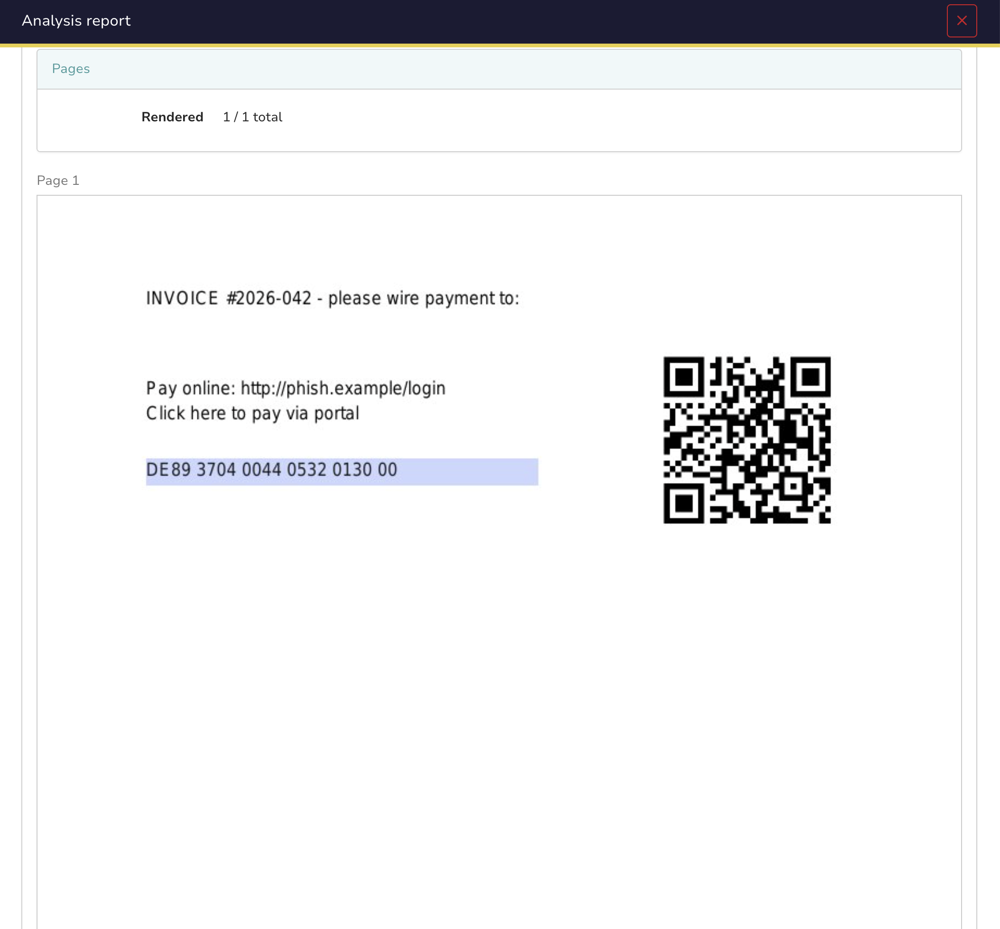

# PDFPreview

Renders the pages of a PDF as images so you can see what the file looks like without opening it. Useful as a first look at a PDF from an untrusted source.

Rendering is done with poppler (`pdftoppm`). The PDF is never opened in a viewer and no JavaScript, forms or embedded content are executed or parsed.

## Report

- Page previews as images, up to `max_pages`
- Page count (rendered / total)
- Taxonomy: `PDFPreview:Pages=N`, or `PDFPreview:Render=failed` (suspicious)
  when nothing could be rendered

A password-protected PDF simply shows up as a render failure instead of an error. That case is flagged as suspicious, since password-protecting an attachment is a common trick to evade scanning.

## Configuration

| Parameter | Default | Description |
|---|---|---|
| `max_pages` | 10 | Maximum number of pages rendered as images |
| `dpi` | 100 | Rendering resolution (72-150 recommended) |

## Notes

- No text extraction, no metadata, no malware verdict. It previews what the PDF looks like.
- No OCR: scanned documents are only visible in the preview images.
- As with any analyzer that processes untrusted files, please run it as a Docker analyzer (the default deployment in Cortex) and keep the image up to date.
