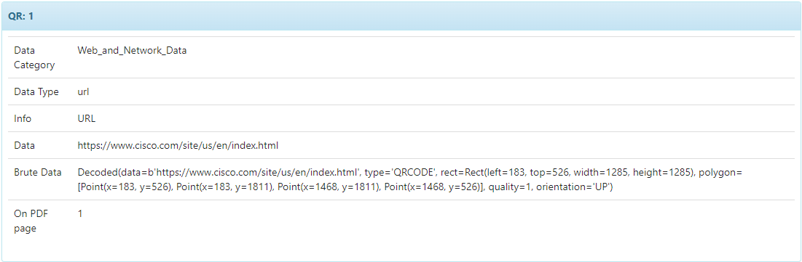
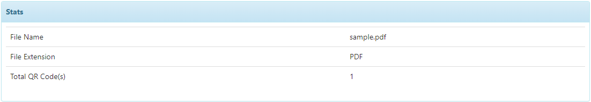

# QrDecode

## Overview

QrDecode is a QR code analyzer used to extracts and categorizes data from QR codes embedded in various file formats. It supports images in JPEG, PNG, GIF formats, and PDF documents.

## Features

- **Multi-format support:** Handles JPEG, PNG, GIF, and PDF files.
- **Data extraction:** Decodes QR codes and identifies data types such as URLs, email addresses, IP addresses, and cryptocurrency addresses.
- **Categorization:** Categorizes extracted data into predefined types and categories.
- **Report Templates:** Report templates available for readability.
- **Error handling:** Detects and reports errors in QR code reading and file format issues.

## Requirements

The following dependencies are required for QrDecode:

### System Libraries

```bash
sudo apt-get install libzbar0
sudo apt-get install poppler-utils
```

### Python Libraries

```plaintext
cortexutils
pyzbar
pdf2image
pillow
```

To install the Python libraries, run:

```bash
pip install -r requirements.txt
```

## Usage

Once installed and configured, QrDecode analyzes files containing QR codes. The analyzer extracts data from QR codes, categorizes it, and returns the results in a structured format. For PDF files, the analyzer automatically converts each page to an image format for comprehensive analysis. It also efficiently processes multiple QR codes within a single image or PDF.

### Running the Analyzer

To run the analyzer, submit a file through The Hive or Cortex interface, selecting QrDecode as the analyzer. The analyzer will process the file and return results including:

- Decoded data from QR codes
- Data types and categories

## Results Details

When the analyze is finished, the report can display:
* A Summary: with qualitative information about the detection



* Stats: with information like : File Name, File Extension, Total number of QR Codes



## Extracted Observables

Moreover, these domains, IP addresses, URLs, bitcoin addresses, email addresses are added to the extracted Observables, ready to be imported and actioned in TheHive.


### Error Handling

The analyzer includes a set of predefined errors to handle cases such as unsupported file formats, failed PDF conversion, and QR code reading issues. These errors are reported back in the analysis results.

## License

QrDecode is licensed under the AGPL-V3 license.

## Version

**1.0**

## Author

- **THA-CERT**