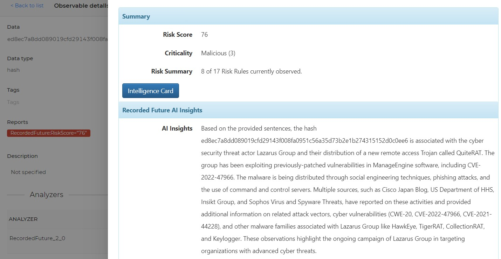
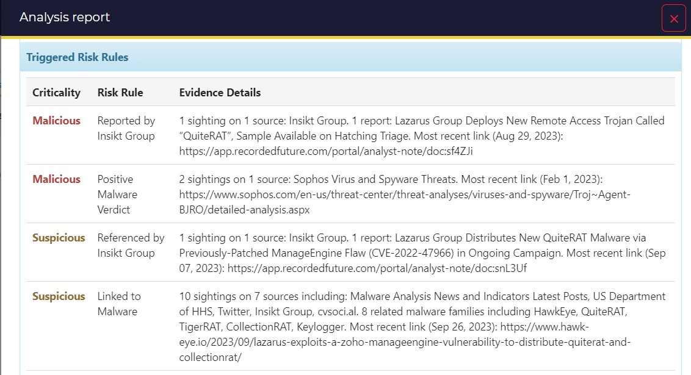

This analyzer will return Recorded Future Intelligence for the following datatypes:
* ip
* domain
* fqdn
* hash
* url

Enriched observables can display:
* Risk Summary: Risk Score, Criticality, and link to the Intelligence Card
* Recorded Future AI Insights

* Risk Rules and Evidence Details

* Technical & Insikt Group Research Links

* Related Threat Actors
* Related Attack Vectors
* Malware Family / Category
* Related IPs
* Related Domains
* Related Hashes