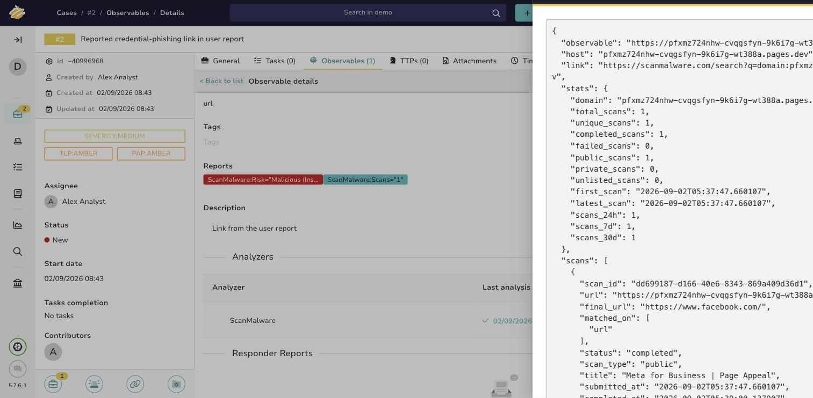

# ScanMalware

Look up a domain, URL or IP in the [ScanMalware](https://scanmalware.com) archive of sandboxed URL
scans. The archive records what a headless browser saw when it visited a page.

**No API key is required.** The API is anonymous; a key only raises the rate limit.

## What it returns

| Observable | Result |
| --- | --- |
| `domain`, `fqdn` | scan statistics, and the scans in which the domain was observed. Each scan says whether it matched on the scanned URL, the final URL after redirects, or both. |
| `url` | the same, plus the scans of that exact URL |
| `ip` | scans that resolved to the address, and the domains seen on it in Certificate Transparency |

For the most recent relevant scan it also returns the scanner's verdict: risk level, confidence,
score and the risk factors behind it.

## Verdict attribution

For a URL, the verdict describes **that URL** when it has been scanned. When it has not, the report
says so explicitly and shows the nearest scan on the same host as a separate, clearly labelled
panel. A verdict for `https://example.com/` is not a verdict on `https://example.com/login`, and the
taxonomy reports `ScanMalware:Risk="not scanned"` rather than borrowing the neighbour's.

The taxonomy is `malicious` only for an explicit high or critical risk level. Anything else is
`info`, never `safe`: the scanner finding nothing is not the same as the site being safe, and a green
badge in a triage queue reads as a clearance.

## Read-only

The analyzer never submits an observable for a new scan. A submitted URL becomes publicly listed in
the archive, which is not a side effect an enrichment run should have.

## Configuration

| Item | Default | Purpose |
| --- | --- | --- |
| `base_url` | `https://scanmalware.com` | point at a different deployment |
| `timeout` | `30` | HTTP timeout in seconds |
| `max_results` | `20` | caps the scan list, and the Certificate Transparency domain list for an IP, which the API returns unlimited |
| `key` | none | optional, raises the rate limit only |
