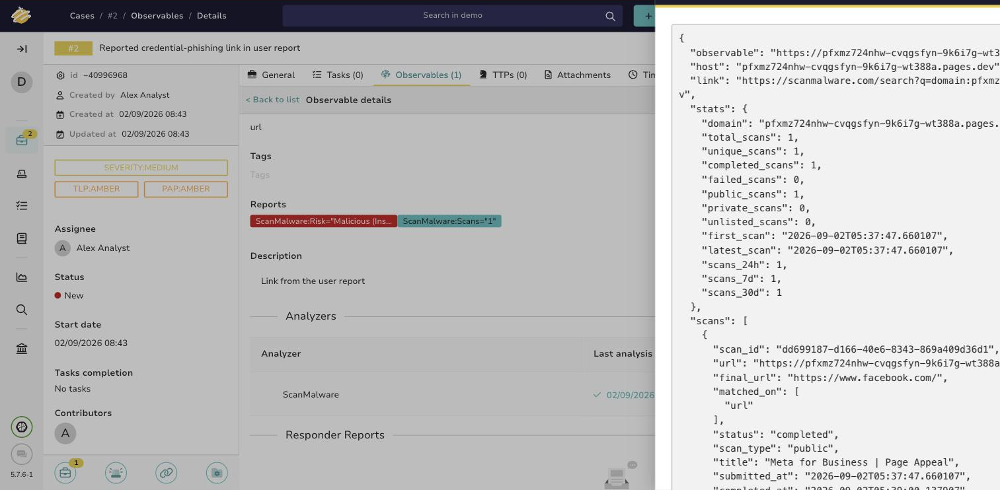

# ScanMalware

Look up a domain, URL or IP in the [ScanMalware](https://scanmalware.com) archive of sandboxed URL
scans. The archive records what a headless browser saw when it visited a page.

**No API key is required.** The API is anonymous; a key only raises the rate limit.

## What it returns

| Observable | Result |
| --- | --- |
| `domain`, `fqdn` | scan statistics, and the scans in which the domain was observed. Each scan says whether it matched on the scanned URL, the final URL after redirects, or both. |
| `url` | the same, plus the scans of that exact URL |
| `ip` | scans that resolved to the address, and the domains seen on it in Certificate Transparency |

For the most recent relevant scan it also returns the scanner's verdict: risk level, confidence,
score and the risk factors behind it.

## Verdict attribution

A verdict is only taken from a scan **of the observable**. A domain's scan list also contains pages
that merely redirected to it, and phishing lures commonly end on the brand they imitate, so the
newest scan listed under `facebook.com` is often a lure hosted elsewhere. Each scan's `matched_on`
field says whether the domain was the scanned URL or only the final URL after redirects, and only the
first counts. Scans of subdomains do not count either, because on shared platforms such as
`github.io` or `pages.dev` they belong to unrelated tenants: the scanned host must be the observable
or its `www.` name. When no scan qualifies, the report lists the scans without a verdict.

An IP gets no verdict: the newest scan on an address is a page that happened to resolve there.

For a URL, the verdict describes **that URL** when it has been scanned. When it has not, the report
says so explicitly and shows the nearest scan on the same host as a separate, clearly labelled
panel. A verdict for `https://example.com/` is not a verdict on `https://example.com/login`, and the
taxonomy reports `ScanMalware:Risk="not scanned"` rather than borrowing the neighbour's.

The taxonomy is `malicious` only for an explicit malicious, critical or high risk level. Anything else is
`info`, never `safe`: the scanner finding nothing is not the same as the site being safe, and a green
badge in a triage queue reads as a clearance.

## Read-only

The analyzer never submits an observable for a new scan. A submitted URL becomes publicly listed in
the archive, which is not a side effect an enrichment run should have.

## Configuration

| Item | Default | Purpose |
| --- | --- | --- |
| `base_url` | `https://scanmalware.com` | point at a different deployment |
| `timeout` | `30` | HTTP timeout in seconds |
| `max_results` | `20` | caps the scan list, and the Certificate Transparency domain list for an IP, which the API returns unlimited |
| `key` | none | optional, raises the rate limit only |
