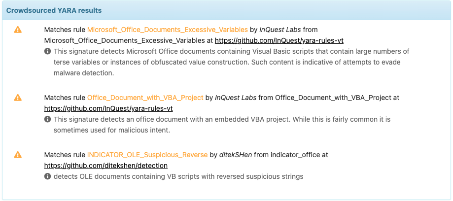

This analyzer let you run Virustotal services on several datatypes: 

* _file_
* _hash_
* _domain_
* _fqdn_
* _ip_
* _url_

The program uses [VirusTotal API v3](https://developers.virustotal.com/v3.0/reference).

Major improvements have been added with _VirusTotal\_GetReport_ flavor. Now, with the classical scan results, the report can display: 

* A Summary: with qualitative informnation about the detection

* Crowdsourced YARA results with known Yara rules to detect the threat

* Contacted IP addresses, domains and URLs if any
* Crowdsourced IDS results with known IDS rules to detect the threat
* Sandbox verdict if any

#### Extracted Observables

Moreover, these domains, IP addresses, URLs as well as detection YARA and IDS rules reported are added to the extracted Observables, ready
to be imported and actioned in TheHive.

