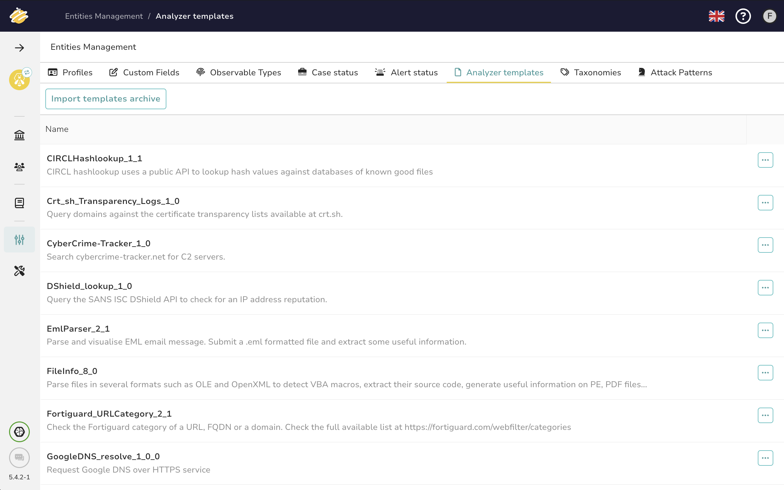

# How to upgrade analyzers & responders to the latest version

This guide outlines the steps to take when there is a new release of Cortex-Analyzers so that you can benefit from the new or updated analyzers and responders.

There are three steps to perform, two of which require user action:

1. **Catalog Update** (automatic)
2. **Configure Analyzers & Responders in Cortex** (user action required)
3. **Update Analyzers' Report Templates** (user action required)

## Step 1: Catalog Update

With **TheHive version 5.0.14 and above** and **Cortex version 3.1.7 and above**, Cortex automatically fetches and updates the catalog. As a result, you may receive a notification in TheHive indicating that action is required if there is any new version of an analyzer or responder you are already using.

This notification can be seen in the *bottom left* corner of your TheHive interface.

Clicking on it will open a drawer indicating if there are any obsolete analyzers or responders.

> **Note:** The automatic catalog update behavior depends on your Cortex configuration. By default, Cortex's `application.conf` points to [`analyzers.json`](https://download.thehive-project.org/analyzers.json) and [`responders.json`](https://download.thehive-project.org/responders.json), which determines how updates are fetched. For more details, refer to the [official documentation](https://docs.strangebee.com/cortex/installation-and-configuration/analyzers-responders/#update-cortex-configuration).

## Step 2: Configure Analyzers & Responders in Cortex

### 2a. Setting Up Newly Available Analyzers or Responders

When new analyzers or responders are available, please refer to the [changelog](https://thehive-project.github.io/Cortex-Analyzers/CHANGELOG/) to review the new additions so you don't miss anything.

Then, perform the following steps:

- **Log in to Cortex** as an Org Administrator
- **Refresh Analyzers and Responders** by navigating to the ***Organization*** section, selecting the ***Analyzers*** and ***Responders*** tab and pressing the ***Refresh*** button.
- **Enable new analyzers and responders** you wish to use.
- **Configure the settings and authentication parameters** as needed.

### 2b. Updating Obsolete Analyzers or Responders

Analyzers or responders become obsolete when a new version is available.

#### Check for Updates in Cortex

- **Log in to Cortex** as an Org Administrator to review available updates.
- Look out for any **red badge notifications**, as they indicate actions that need your attention.
- **Refresh Analyzers and Responders** by navigating to the ***Organization*** section, selecting the ***Analyzers*** and ***Responders*** tab and pressing the ***Refresh*** button.

#### Update Your Configuration

- If there is a version increment, **disable older versions** that are no longer needed, and enable the new versions by pressing the "Enable" button on the newer one.
- **Configure the settings and authentication parameters** as needed.

## Step 3: Update the Analyzers' Report Templates

If you're using **TheHive 5**, remember to always **import the new report templates** into your instance. This step is essential for an optimal experience with the updated analyzers and responders. Otherwise, you may encounter issues with the report templates for the new analyzers.

Refer to the [official documentation on how to update Analyzers templates](https://docs.strangebee.com/thehive/administration/analyzers-templates/) in your TheHive tenant.

