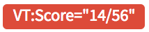
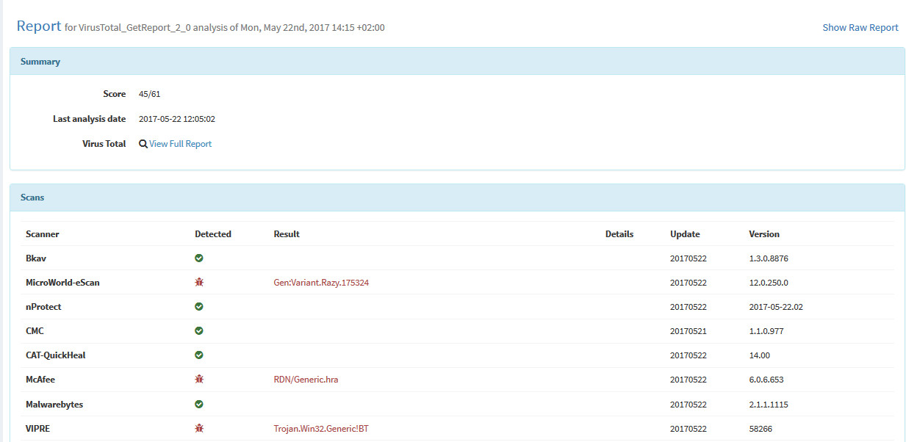

# How to Write and Submit an Analyzer

## Writing an Analyzer

An analyzer is a program that takes an observable and
configuration information as **raw input**, analyze the observable and
produces a result as **raw output**. It is made of at least 2 types of files:

- The program itself
- One or several service interaction files or flavors
- A Python requirements file, which is only necessary if the analyzer is
written in Python.

### The Program
The first type of files an analyzer is made of is the core program that
performs actions. It can be written in any programming
language that is supported by Linux.

While many analyzers are written in Python (`*.py` files), you can write yours
in Ruby, Perl or even Scala. However, the very handy `Cortexutils` library
[described below](#the-cortexutils-python-library) is in Python. It greatly facilitates analyzer development and
it also provides some methods to quickly format the output to make it compliant
with the JSON schema expected by [TheHive](https://github.com/TheHive-Project/TheHive/).

### Service Interaction Files (Flavors)
An analyzer must have at least one service interaction file. Such files
contain key configuration information such as the analyzer's author
information, the datatypes (IP, URL, hash, domain...) the analyzer accepts as
input, the TLP and PAP ([Permissible Actions Protocol](https://www.misp-project.org/taxonomies.html#_pap)) above which it will refuse to execute to protect against data leakage and to enforce sane OPSEC practices and so on.

An analyzer can have two or more service interaction files to allow it to
perform different actions.  We speak then of flavors. For example, a sandbox analyzer can analyze a file with or without an
Internet connection. Another example could be an analyzer that can either
send a file to VirusTotal for analysis or get the last report using its hash.

### Python Requirements
If the analyzer is written in Python, a `requirements.txt` must be provided
with the list of all the dependencies.

### Example: VirusTotal Analyzer Files
Below is a directory listing of the files corresponding to the VirusTotal
analyzer. You can see that the analyzer has two flavors: **GetReport** and
**Scan**.

```bash
analyzers/VirusTotal
|-- VirusTotal_GetReport.json
|-- VirusTotal_Scan.json
|-- requirements.txt
|-- virustotal.py
`-- virustotal_api.py
```

### Input
The input of an analyzer is a JSON structure with different
pieces of information. For example, to use the VirusTotal analyzer's
**GetReport** flavor in order to obtain the latest available report for hash
`d41d8cd98f00b204e9800998ecf8427e`, you must submit input such as:


```json
{
    "data":"d41d8cd98f00b204e9800998ecf8427e",
    "dataType":"hash",
    "tlp":0,
    "config":{
        "key":"1234567890abcdef",
        "max_tlp":3,
        "check_tlp":true,
        "service":"GetReport"
        [..]
    },
    "proxy":{
        "http":"http://myproxy:8080",
        "https":"https://myproxy:8080"
      }
  }
```

`data`, `dataType` and `tlp` are the observable-related information generated by
TheHive or any other program that is calling Cortex. `config` is the
analyzer's specific configuration provided by an `orgAdmin` users when the analyzer is enabled in the Cortex UI.

Let's take the **GetReport** flavor of the VirusTotal analyzer as an
example again.

#### Example: VirusTotal Get Report's Input

```json
{
    "data":"d41d8cd98f00b204e9800998ecf8427e",
    "dataType":"hash",
    "tlp":0,
    [..]
  }
```

#### Example: Service Interaction File for VirusTotal GetReport
The `<==` sign and anything after it are comments that do no appear in the
original file.
```json
{
  "name": "VirusTotal_GetReport",
  "version": "3.0",
  "author": "CERT-BDF",
  "url": "https://github.com/TheHive-Project/Cortex-Analyzers",
  "license": "AGPL-V3",
  "description": "Get the latest VirusTotal report for a file, hash, domain or an IP address.",
  "dataTypeList": ["file", "hash", "domain", "ip"],
  "command": "VirusTotal/virustotal.py", <== Program to run when invoking the analyzer
  "baseConfig": "VirusTotal", <== name of base config in Cortex analyzer config page
  "config": {
    "service": "get"
  },
  "configurationItems": [ <== list of configuration items the analyzer needs to operate (api key etc.)
    {
      "name": "key",
      "description": "API key for Virustotal",
      "type": "string", <== defines what kind of data type the configuration item is (string, number)
      "multi": false, <== setting multi to true allows to pass a list of items (e.g. MISP analyzer)
      "required": true 
    },
    {
      "name": "polling_interval",
      "description": "Define time interval between two requests attempts for the report",
      "type": "number",
      "multi": false,
      "required": false,
      "defaultValue": 60
    }
  ]
}
```

### Service Interaction Configuration Items
#### name
Name of the specific service (or flavor) of the analyzer.

If your analyzer has only one service interaction (i.e. performs only one
action), it is the name of the analyzer's directory.

If your analyzer performs several actions (i.e. comes in several flavors),
you have to give a specific and meaningful name to each flavor.

Each flavor's name appear in TheHive's analyzer list and in MISP when you
use Cortex for attribute enrichment.

#### version
The version of the analyzer.

You **must** increase major version numbers when new features are added,
modifications are made to take into account API changes, report output is
modified or when report templates (more on this later) are updated.

You must increase minor version numbers when bugs are fixed.

The version number is also used in the folder name of the associated report
templates ; e.g. *VirusTotal\_GetReport* and *3.0* on the JSON file should
correspond a folder named *VirusTotal\_GetReport\_3\_0* for report templates.
 Report templates are used by TheHive to display the analyzer's JSON output
 in an analyst-friendly fashion.

#### author
You must provide your full name and/or your organization/team name when
submitting an analyzer. Pseudos are not accepted. If you'd rather remain
anonymous, please contact us at support@thehive-project.org prior to
submitting your analyzer.

#### url
The URL where the analyzer is stored. This should ideally be
`https://github.com/TheHive-Project/Cortex-Analyzers`

#### license
The license of the code. Ideally, we recommend using the AGPL-v3
license.

Make sure your code's license is compatible with the license(s) of the
various components and libraries you use if applicable.

#### description
Description of the analyzer. Please be concise and clear. The description is
 shown in the Cortex UI, TheHive and MISP.

#### dataTypeList
The list of TheHive datatypes supported by the analyzer. Currently TheHive
accepts the following datatypes:

- domain
- file
- filename
- fqdn
- hash
- ip
- mail
- mail-subject
- other
- regexp
- registry
- uri_path
- url
- user-agent

If you need additional datatypes for your analyzer, please let us know at
[support@thehive-project.org](mailto:support@thehive-project.org).

#### baseConfig
Name used to group configuration items common to several analyzer. This
prevent the user to enter the same API key for all analyzer flavors.
The Cortex analyzer config page group configuration items by their `baseConfig`.  

#### config
Configuration dedicated to the analyzer's flavor. This is where we
 typically specify the TLP level of observables allowed to be analyzed with the
 `check_tlp` and `max_tlp` parameters. For example, if `max_tlp` is set to `2` (TLP:AMBER),
 TLP:RED observables cannot be analyzed.

#####  max_tlp
The TLP level above which the analyzer must not be executed.

| TLP   |     max_tlp value     |
|:----------:|:-------------:|
| Unknown |  -1 |
| WHITE |   0  |
| GREEN | 1 |
| AMBER | 2 |
| RED | 3 |


##### check_tlp
This is a boolean parameter. When `true`, `max_tlp` is checked. And if the
input's TLP is above `max_tlp`, the analyzer is not executed.

For consistency reasons, we do recommend setting both `check_tlp` and
`max_tlp` even if `check_tlp` is set to `false`.

#####  max_pap
The PAP level above which the analyzer must not be executed.

| TLP   |     max_tlp value     |
|:----------:|:-------------:|
| Unknown |  -1 |
| WHITE |   0  |
| GREEN | 1 |
| AMBER | 2 |
| RED | 3 |


##### check_pap
This is a boolean parameter. When `true`, `max_pap` is checked. And if the
input's PAP is above `max_pap`, the analyzer is not executed.

For consistency reasons, we do recommend setting both `check_pap` and
`max_pap` even if `check_pap` is set to `false`.

##### command
The command used to run the analyzer. That's typically the full, absolute
path to the main program file.

#### configurationItems
The list of configurationItems is necessary in order to be able to set all configuration variables for analyzers directly in the Cortex 2 user interface. As in the VirusTotal example above can be seen, every item is a json object that defines:
- name (string)
- description (string)
- type (string)
- multi (boolean)
- required (boolean)
- defaultValue (according to type, optional)

The `multi` parameter allows to pass a list as configuration variable instead of a single string or number. This is used e.g. in the MISP analyzer that queries multiple servers in one run and needs different parameters for that.

### Output
The output of an analyzer depends on the success or failure of its execution.

If the analyzer **fails** to execute:

```json
{
    "success": false,
    "errorMessage":".."
}
```

-   When `success` is set to `false`, it indicates that something went wrong
    during the execution.
-   `errorMessage` is free text - typically the error output message.

If the analyzer **succeeds** (i.e. it runs without any error):

```json
{
    "success":true,
    "artifacts":[..],
    "summary":{
        "taxonomies":[..]
    },
    "full":{..}
}
```

-   When `success` is set to `true`, it indicates that the analyzer ran
    successfully.
-   `artifacts` is a list of indicators extracted from the produced report.
-   `full` is the full report of the analyzer. It is free form, as long
as it is JSON formatted.
-   `summary` is used in TheHive for short reports displayed in the
    observable list and in the detailed page of each observable. It
    contains a list of taxonomies.
    -   `taxonomies`:

    ```json
    "taxonomies":[
      {
          "namespace": "NAME",
          "predicate": "PREDICATE",
          "value": "\"VALUE\"",
          "level":"info"
      }
    ]
    ```

    -   `namespace` and `predicate` are free values but they should be as
     concise as possible. For example, the VirusTotal analyzer uses *VT*
     as a namespace and *Score* as a predicate.
    -   `level` intends to convey the maliciousness of the result:
        :
        -   `info` : the analyzer produced an information, and the
            short report is shown in blue color in TheHive.
        -   `safe` : the analyzer did not find anything suspicious
            or the analyzed observable is safe according to
            the analyzer. TheHive displays the short report in green
            color.
        -   `suspicious` : the analyzer found that the observable is
            either suspicious or warrants further investigation. The
            short report has an orange color in TheHive.
        -   `malicious` : the analyzer found that the observable
            is malicious. The short report is red colored in TheHive.

For more information refer to [our blog](https://blog.thehive-project.org/2017/07/05/all-fresh-cortexutils-new-cortex-analyzers/).


### The Cortexutils Python Library
So far, all the published analyzers have been written in Python. We
released a special Python library called `cortexutils` to help developers easily write their programs. Note though that Python is not mandatory for analyzer coding and any language that runs on Linux can be used, though you won't have the benefits of the CortexUtils library.

Cortexutils can be used with Python 2 and 3.
To install it :

```bash
pip install cortexutils
```

or

```bash
pip3 install cortexutils
```

This library is already used by all the analyzers published in our [Github
repository](https://github.com/TheHive-Project/Cortex-Analyzers). Feel free to
start reading the code of some of them before writing your own.

### Report Templates
When using TheHive, analysts can submit an observable for analysis to one or
several Cortex instances by a click of a button. Once finished,
Cortex returns the result to TheHive. The TheHive displays that result
using HTML templates for short and long reports.

#### Cortex Result in TheHive
TheHive receives the Cortex result which is simply the JSON formatted
analyzer output described above:

-   The `summary` section is read to display short reports in the observables
list and in the detailed observable page. This is stored in a **dict** object
named `content` within TheHive.
-   The `full` section is read to display long reports when clicking the short
    report in the observable list or when accessing a detailed observable
    page. In TheHive application, it is stored in a **dict** object named
    `content`.

#### Displayed Information

##### When No Template is Imported
In the event that the analyzer report templates are not imported in TheHive
(only administrators can do such an operation via the *Admin > Report
Templates* menu):

-   In the observable list, TheHive is able to display the analyzer `summary`
    results using a builtin style sheet associated with the previously
    described taxonomy.
-   In the detailed observable page:
      + the `full` result is displayed in raw format (the JSON output from
      Cortex)
      + the `summary` result is **not displayed**.

##### When Templates are Imported
If templates are imported into TheHive:

-   Short reports are displayed in the observable list and in the detailed
observable page.



-   Long reports are displayed when clicking on the short reports or in the
detailed observable page.




#### Writing Templates

To display results nicely in TheHive, write two HTML templates:

- One for short reports
- One for long reports

When TheHive users import them in the application, they will be definitely
more efficient at reading the analyzer reports and do their job accordingly.

If the analyzer is made of different flavors (i.e. has different service
interaction files with a `json` extension), you should provide two HTML
templates (short and long reports) for each flavor.

For example, the VirusTotal analyzer comes in two flavors hence it has 4 HTML
 templates:

```bash
thehive-templates/VirusTotal_GetReport_3_0
|-- long.html
`-- short.html
thehive-templates/VirusTotal_Scan_3_0
|-- long.html
`-- short.html
```

The folder's name is the concatenation of the `name` and the
`version` values found in the service interaction files.

TheHive uses Bootstrap and AngularJS so you can leverage them in your
templates.

##### Short Report Templates (short.html)

The short report uses taxonomies and is built into the analyzers by the
`summary()` function. Report templates read it as shown in the example below:

```html
<span class="label" ng-repeat="t in content.taxonomies"
  ng-class="{'info': 'label-info', 'safe': 'label-success',
  'suspicious': 'label-warning',
  'malicious':'label-danger'}[t.level]">
    {{t.namespace}}:{{t.predicate}}={{t.value}}
</span>
```

If you want to change or add the information displayed in the short report in
the detailed observable page, you have to update the
`summary()` function in the analyzer's program and edit short.html as
well. Basically, copy the code in your short.html template and it will
do the job.

##### Long Report Templates (long.html)
Long report templates are more or less free form as long as it reads the
content of the relevant section in the Cortex result (`full`). Feel
free to check what has already been written for existing analyzers to write
yours.

A good start can be:

```html
<!-- Success -->
<div class="panel panel-danger" ng-if="success">
    <div class="panel-heading">
        ANALYZERNAME Report
    </div>
    <div class="panel-body">
        [...]                      <= code here
    </div>
</div>

<!-- General error  -->
<div class="panel panel-danger" ng-if="!success">
    <div class="panel-heading">
        <strong>{{(artifact.data || artifact.attachment.name) | fang}}</strong>
    </div>
    <div class="panel-body">
        <dl class="dl-horizontal" ng-if="content.errorMessage">
            <dt><i class="fa fa-warning"></i> ANALYZERNAME: </dt>
            <dd class="wrap">{{content.errorMessage}}</dd>
        </dl>
    </div>
</div>
```

## Submitting an Analyzer
We **highly encourage you to share your analyzers** with the community through our Github repository. To do so, we invite you to follow a few steps before submitting a pull request.

### Check Existing Issues
Start by checking [if an issue already exists](https://github.com/TheHive-Project/Cortex-Analyzers/issues?utf8=%E2%9C%93&q=is%3Aissue%20is%3Aopen%20label%3A%22feature%20request%22%20label%3Aanalyzer) for the analyzer you'd like to write and contribute. Verify that nobody is working on it. If an issue exists and has the **in progress**, **under review** or **pr-submitted** label, it means somebody is already working on the code or has finished it.

If you are short on ideas, check issues with a [**help wanted** label](https://github.com/TheHive-Project/Cortex-Analyzers/issues?utf8=%E2%9C%93&q=is%3Aissue%20is%3Aopen%20label%3A%22help%20wanted%22). If one of those issues interest you, indicate that you are working on it.

### Open an Issue
If there's no issue open for the analyzer you'd like to contribute, [open one](https://github.com/TheHive-Project/Cortex-Analyzers/issues/new). Indicate that you are working on it to avoid having someone start coding it.

You have to create an issue for each analyzer you'd like to submit.

### Review your Service Interaction File(s)
Review your service interaction files. For example, let's check the
VirusTotal JSON analyzer configuration file(s):

```json
{
    "name": "VirusTotal_GetReport",
    "version": "3.0",
    "author": "CERT-BDF",
    "url": "https://github.com/TheHive-Project/Cortex-Analyzers",
    "license": "AGPL-V3",
    "description": "Get the latest VirusTotal report for a file, hash, domain or an IP address",
    "dataTypeList": ["file", "hash", "domain", "ip"],
    "baseConfig": "VirusTotal",
    "config": {
        "check_tlp": true,
        "max_tlp": 3,
        "service": "get"
    },
    "command": "VirusTotal/virustotal.py"
}
```
Ensure that all information is correct and particularly the `author` and
`license` parameters.

### Provide the List of Requirements
If your analyzer is written in Python, make sure to complete the
`requirements.txt` file with the list of all the external libraries that are
needed to run the analyzer correctly.

### Check the Taxonomy
We chose to use a formatted summary report to match a taxonomy as
described above. If you want your analyzer reports in the observable lists,
ensure that your summary matches this format. If your analyzer is
written in Python and you are using our `cortexutils` library,
you can use the `summary()`and `build_taxonomy()` functions.

### Provide Global Configuration Parameters
When submitting your analyzer, please provide the necessary global
configuration in `/etc/cortex/application.conf` if needed. You can provide this information in a `README` file.

### Verify Execution
Use these three simple checks before submtting your analyzer:

-   Ensure it works with the expected configuration, TLP or dataType.
-   Ensure it works with missing configuration, dataType or TLP: your
analyzer must generate an explicit error message.
-   Ensure the long report template handles error messages correctly.

### Create a Pull Request
Create one Pull Request per analyzer against the **develop** branch of the
[Cortex-Analyzers](https://github.com/TheHive-Project/Cortex-Analyzers/) repository. Reference the issue you've created in your PR.

We have to review your analyzers. Distinct PRs will allow us to review them
more quickly and release them to the benefit of the whole community.

## Need Help?
Something does not work as expected? No worries, we got you covered. Please
join our [user forum](https://groups.google.com/a/thehive-project.org/forum/#!forum/users),
 contact us on [Gitter](https://gitter.im/TheHive-Project/TheHive), or send us
 an email at [support@thehive-project.org](mailto:support@thehive-project
 .org). We are here to help.
