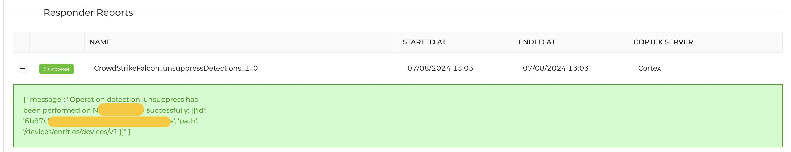
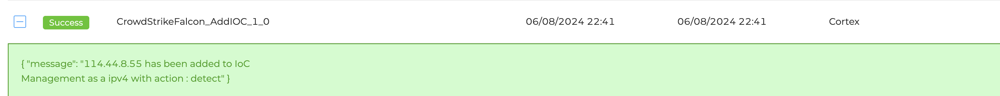
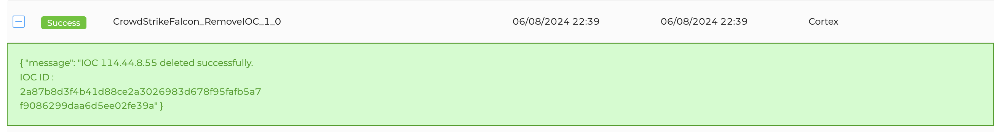
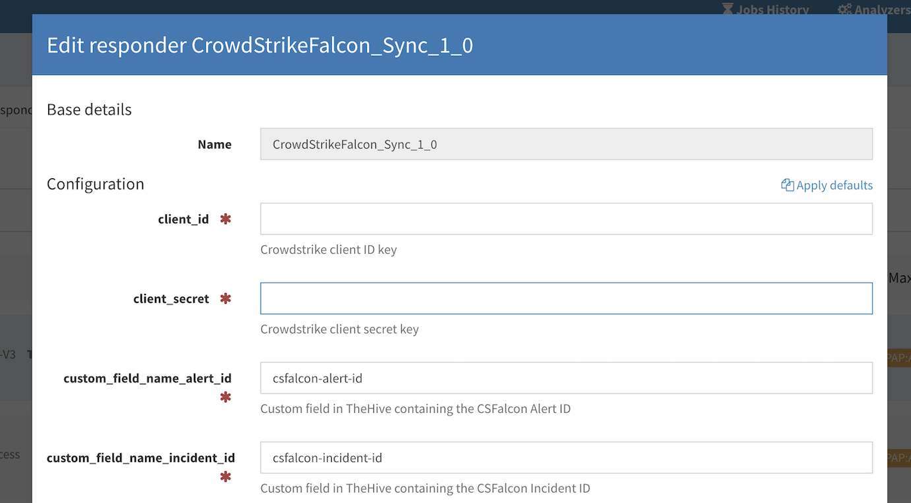

# CrowdStrike Falcon Responders

This documentation covers the setup and usage of CrowdStrike Falcon responders for performing various actions on **hosts**, managing **Indicators of Compromise (IoCs)**, and synchronizing **alerts and incidents** from TheHive to CrowdStrike Falcon.

---

## Pre-requisites

1. **CrowdStrike Falcon Setup**:
   - Log in to your CrowdStrike Falcon tenant.
   - Navigate to **Support and resources > Resources and tools > API clients and keys**.
   - Create an **API Client** with the required permissions based on the responder:
     - **Hosts**: Read, Write (for `CrowdstrikeFalcon_Hosts`).
     - **IOC**: Read, Write (for `CrowdstrikeFalcon_IOC`).
     - **Alerts**: Read, Write (for `CrowdstrikeFalcon_Sync`).
     - **Incidents**: Read, Write (for `CrowdstrikeFalcon_Sync`).

2. **TheHive Setup** (for `CrowdstrikeFalcon_Sync`):
   - Log in to TheHive.
   - Navigate to **Admin organization > Entities Management > Custom fields**.
   - Create the following **custom fields**:
     - `csfalcon-alert-id` (type: **string**) – to store CrowdStrike Falcon alert IDs.
     - `csfalcon-incident-id` (type: **string**) – to store CrowdStrike Falcon incident IDs.

---

## Responders Overview

### 1. **CrowdstrikeFalcon_Hosts Responder**

- **Description**: This responder provides multiple response actions on CrowdStrike Falcon hosts, including:
  - Contain host
  - Lift containment
  - Suppress detections
  - Unsuppress detections
  - Hide host
  - Unhide host
- **Permissions Required**: `Hosts: Read, Write`

#### **Available Responders**

#### **Responder Configuration**

#### **Result**
Provides execution details for host actions, such as containment status or detection suppression results.

---

### 2. **CrowdstrikeFalcon_IOC Responder**

- **Description**: This responder allows for the addition or removal of Indicators of Compromise (IoCs) in the CrowdStrike Falcon **IoC Management** section. Supported IoC types include:
  - **Hashes**:
    - `sha256`
    - `md5`
    - `sha1`
  - **IP Addresses**:
    - `IPv4`
    - `IPv6`
  - **Domains**:
    - Domains or URLs (automatically extracts the domain from URLs).
- **Permissions Required**: `IOC: Read, Write`

#### **Available Responders**

#### **Responder Configuration**

#### **Result**
Provides execution details for IoC management actions, such as successful addition or removal of IoCs.

---

### 3. **CrowdstrikeFalcon_Sync Responder**

- **Description**: This responder performs **one-way status synchronization** from **TheHive** to **CrowdStrike Falcon**. It supports execution on both **alerts** and **cases** in TheHive.  
  The synchronization relies on custom fields in TheHive containing:
  - `csfalcon-alert-id` – for CrowdStrike Falcon Alert IDs.
  - `csfalcon-incident-id` – for CrowdStrike Falcon Incident IDs.

- **Permissions Required**: 
  - `Alerts: Read, Write`
  - `Incidents: Read, Write`

#### **Responder Configuration**

#### **Result**
Provides synchronization success/failure from TheHive to CrowdStrike Falcon.

---

## Resources

For more information on the relevant CrowdStrike Falcon APIs, refer to the following resources:
- [CrowdStrike Falcon Hosts API](https://www.falconpy.io/Service-Collections/Hosts.html)
- [CrowdStrike Falcon IoC Management API](https://www.falconpy.io/Service-Collections/IOC.html)
- [CrowdStrike Falcon Alerts API](https://www.falconpy.io/Service-Collections/Alerts.html)
- [CrowdStrike Falcon Incidents API](https://www.falconpy.io/Service-Collections/Incidents.html)
