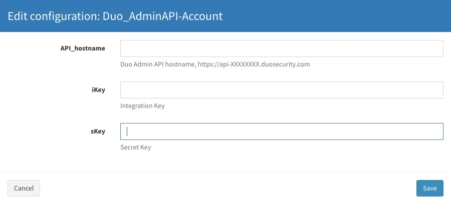
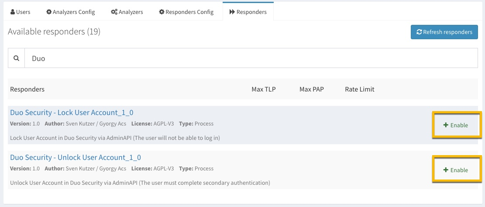
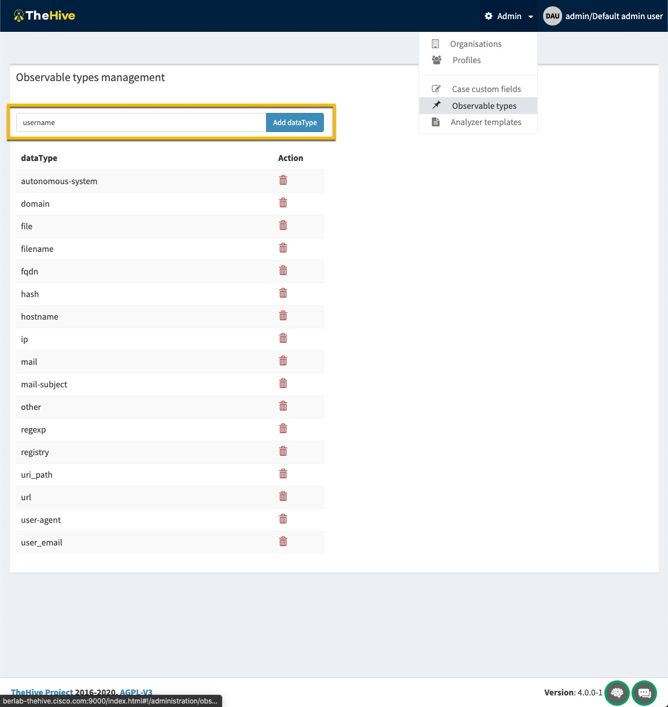

### CortexResponder_DuoUserAccount
Rep. for Cortex Responder (TheHive project - https://github.com/TheHive-Project/CortexDocs)
to Lock/Unlock User Accounts in the Duo Admin Portal (Cisco Security)

There are two Responder available in order to change the status of a User in Duo Security via the AdminAPI (https://duo.com/docs/adminapi)

**DuoLockUserAccount** -> changes the "status" to “disabled” - The user will not be able to log in.

**DuoUnlockUserAccount** ->  changes the "status" to “active” - The user must complete secondary authentication.

The Responder is looking for a "**username**" as input and queries the Duo Admin API, to receive the associated UserID.
The UserID is used to change the "status" of the particular user.

#### How to install:
  * copy the folders "DuoLockUserAccount" & "DuoUnlockUserAccount" into your Cortex responders path
  * install necessary python modules from the requirements.txt (**pip install -r requirements.txt**)
  * restart Cortex to initialize the new Responder "**systemctl restart cortex**"
  * add the ResponderConfig 
  * 
  * enable the Responder Actions
  * 
 
#### Add Observable type in TheHive**
  * per default TheHive has no "username" Observable type, so we have to add this in the Admin settings
  * 

#### Run the Responder action in TheHive

If you have add an observable, you can now take action and lock/unlock the User in Duo Security
 * 
