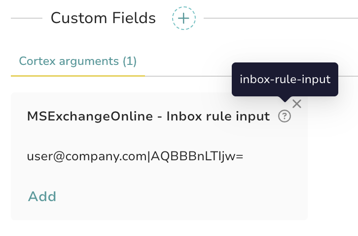
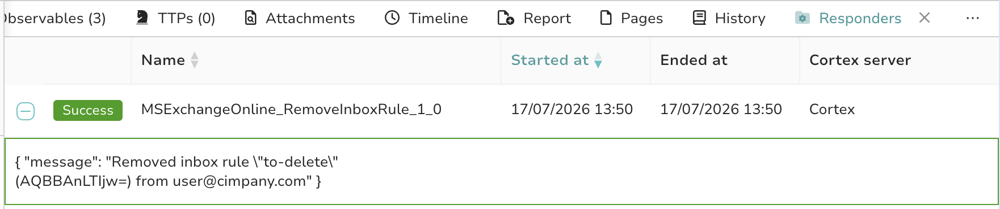

# Microsoft Exchange Online Responder

Removes a malicious Exchange Online inbox rule (for example an external auto-forward set up after a mailbox compromise) via the Microsoft Graph API. Complements the [MSExchangeOnline_GetInboxRules](../../analyzers/MSExchangeOnline/README.md) analyzer, which identifies suspicious rules and their rule IDs.

Requires a Microsoft Entra ID app registration (client ID + secret) with admin-consented application permissions.

---

## MSExchangeOnline_RemoveInboxRule

Deletes a specific inbox (message) rule from a user's mailbox.

### Graph endpoints

- [`GET /users/{id}/mailFolders/inbox/messageRules/{ruleId}`](https://learn.microsoft.com/en-us/graph/api/messagerule-get?view=graph-rest-1.0) — fetch the rule name, detect already-removed rules
- [`DELETE /users/{id}/mailFolders/inbox/messageRules/{ruleId}`](https://learn.microsoft.com/en-us/graph/api/messagerule-delete?view=graph-rest-1.0)

### Behavior

Runs on `thehive:case`. The target is read from a case custom field (name set by the `custom_field_name` config item, defaults to `inbox-rule-input`), formatted as:

```
<mailboxUPN>|<ruleId>
```

Example: `usere@examcompanyple.com|AQAAAJ5dZp8=`

The rule ID comes from the GetInboxRules analyzer report. If the rule no longer exists (HTTP 404), the responder reports it as already removed instead of failing. On success, it adds the tag `MSExchangeOnline:RuleRemoved:<upn>:<rule_name>` to the case.

### Setup in TheHive

Create a case custom field named `inbox-rule-input` (type: *string*) in TheHive's admin settings, and fill it before running the responder on the case. If you use a different field name, set the `custom_field_name` configuration item to match.



### Report example



---

## Setup: Create the Entra ID Credentials

Follow the same steps as the analyzer ([full guide here](../../analyzers/MSExchangeOnline/README.md#setup-create-the-entra-id-credentials)): app registration, client secret, then grant the following application permissions with admin consent:

| Permission | Type | Why |
|---|---|---|
| `MailboxSettings.ReadWrite` | Application | Read and delete inbox message rules |
| `User.Read.All` | Application | Resolve the mailbox UPN to the user object ID |

`MailboxSettings.ReadWrite` includes read access, so a single app registration with this permission (plus `User.Read.All`) can serve both the analyzer and this responder.

Feel free to restrict the app to the mailboxes it needs with an Exchange Online [application access policy](https://learn.microsoft.com/en-us/graph/auth-limit-mailbox-access) if needed.

---

## Configuration

- **`tenant_id`**: Microsoft Entra ID Tenant ID
- **`client_id`**: Application (client) ID of your Entra ID app registration
- **`client_secret`**: Client secret generated for that app
- **`custom_field_name`** *(optional)*: Name of the case custom field holding `<mailboxUPN>|<ruleId>`. Defaults to `inbox-rule-input`.

---

## References

- [Delete messageRule](https://learn.microsoft.com/en-us/graph/api/messagerule-delete?view=graph-rest-1.0)
- [Microsoft Graph Permissions Reference](https://learn.microsoft.com/en-us/graph/permissions-reference)
- [Get access without a user (client credentials flow)](https://learn.microsoft.com/en-us/graph/auth-v2-service)
- [Limiting application permissions to specific Exchange Online mailboxes](https://learn.microsoft.com/en-us/graph/auth-limit-mailbox-access)
