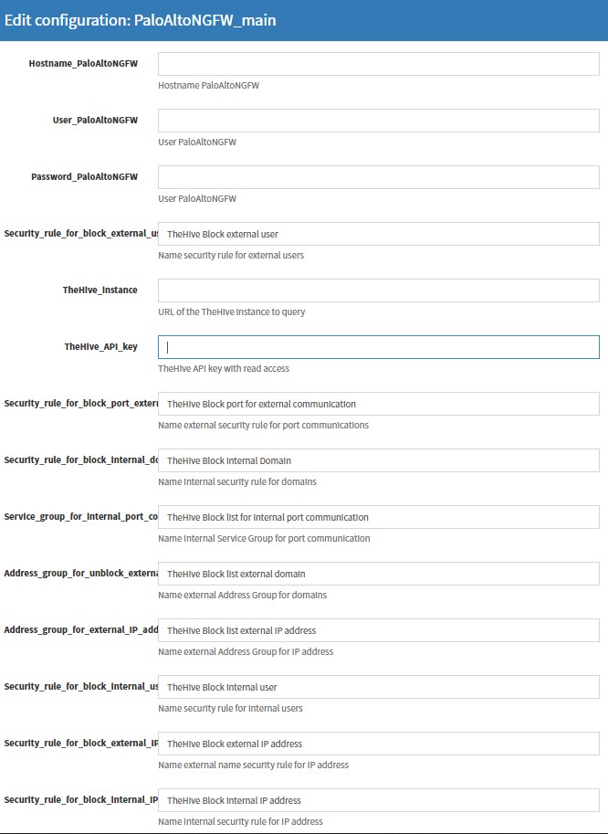

### Description of the responder module operation for the Palo Alto NGFW system

This description contains the required actions from the engineer to integrate the responder with the Palo Alto NGFW.

#### Installation

need install:
1. pip install cortexutils
2. pip install requests
3. pip install pan-os-python
4. pip install thehive4py

###  ToDo
For responders to work, you need to upload the PaloAltoNGFW folder to the directory where other responders are stored.
Further it is necessary:
- Reboot the cortex system;

- To configure the responder, go to the cortex web console, go to the "Organization" tab, select the organization for which the configuration will be performed and go to the "Responders Config" tab and configure the fields for "PaloAltoNGFW_main" in accordance with their values:

1. Hostname_PaloAltoNGFW - network address of the PaloAltoNGFW system
2. User_PaloAltoNGFW - user in the PaloAltoNGFW system
3. Password_PaloAltoNGFW - password for the user in the PaloAltoNGFW system
4. Security_rule_* - the name of the security rule in the PaloAltoNGFW system. The following standard rule names have been established:  
4.1 To block/unblock user:  
4.1.1 "TheHive Block internal user"  
4.1.2 "TheHive Block external user"  

4.2 To block/unblock network addresses:
4.2.1 "TheHive Block internal IP address"  
4.2.2 "TheHive Block external IP address"  

4.3 To block/unblock FQDN:  
4.3.1 "TheHive Block external Domain"  
4.3.2 "TheHive Block internal Domain"  

4.4 To block/unblock ports: 
4.4.1 "TheHive Block port for internal communication"  
4.4.2 "TheHive Block port for external communication"  

4.5 TheHive_instance - url address of The Hive system (used only for case and alert types).
It is important for each organization to have its own user with the API!

4.6 TheHive_API_key - API key to connect to TheHive system  
Note: the specified safety rules must be created in PaloAltoNGFW, and also placed in the order of their application.  
Types of data used to work in TheHive system:
1. Network address - 'ip'
2. FQDN - 'hostname'
3. port-protocol - 'port-protocol'
4. Username - 'username'  
Note: types 'port-protocol' and 'username' need to be created in TheHive system. By default, TheHive does not have these data types in the Observable type, so you must add it in the admin settings.  

