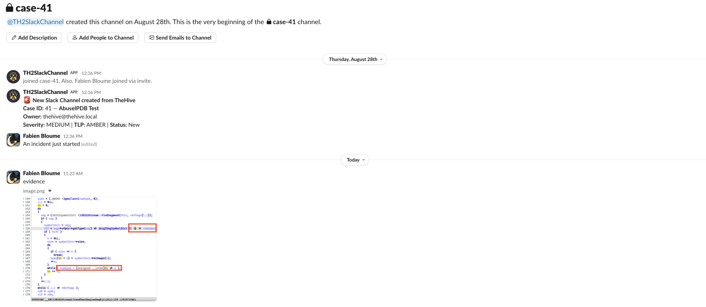
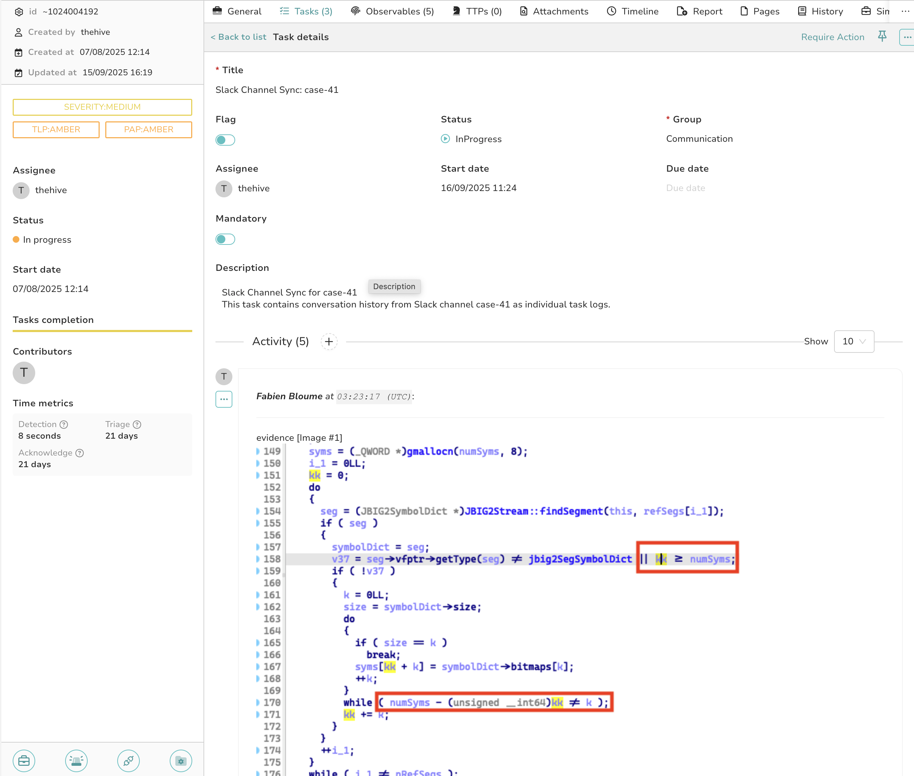
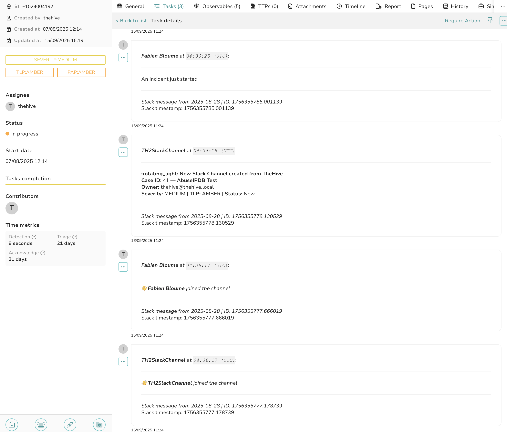

# Slack Responders

  

This directory contains two Slack responders for TheHive integration:

1. **Slack_CreateChannel**: Creates a Slack channel for a TheHive case, invites participants, and optionally posts a case summary and description.
2. **Slack_SyncChannel**: Syncs Slack channel conversations to TheHive task logs. Imports messages chronologically with file attachments for traceability.

---

## Features

### Slack_CreateChannel
- Creates a Slack channel named `case-<caseId>` (customizable prefix)
- Invites default participants by email
- Sets channel visibility (private or public)
- Posts case summary and/or case description (optional)
- **Automatically tags the case** with `slack:<channel_name>` for easy tracking

### Slack_SyncChannel
- **Syncs all Slack channels tagged with `slack:` prefix** on the case
- Retrieves all conversation history from tagged channels
- **Fallback**: If no tags found, uses default format `#case-CASEID`
- Creates TheHive tasks in "Communication" category with individual task logs for each message
- Downloads and attaches file attachments (images, documents) to task logs
- Chronologically ordered messages with timestamps and usernames
- Prevents duplicate syncing by tracking message timestamps
- Converts Slack user IDs to readable usernames for better readability
- **Multi-channel support**: Syncs multiple channels if multiple `slack:` tags exist

## Preview

  
  
  

---

## Requirements

- A Slack workspace where you have permissions to create a bot.
- Your bot must be allowed to create channels and invite users.

---

## 1. Create a Slack App & Bot Token

1. Go to [Slack API: Your Apps](https://api.slack.com/apps) and click **"Create New App"**.
2. Choose **From scratch**, name your app, and pick your workspace.
3. Under **Features**, click **OAuth & Permissions**.
4. **Add these OAuth scopes** under **Bot Token Scopes**:

   **For Slack_CreateChannel:**
    - `groups:write` - Manage private channels that your slack app has been added to and create new ones
    - `groups:write.invites` - Invite members to private channels  
    - `groups:write.topic` - Set the description of private channels
    - `groups:read` - View basic information about private channels that your slack app has been added to
    - `users:read.email` - Look up user IDs by email
    - `chat:write` — Send messages as the bot
    
   **For Slack_SyncChannel (additional scopes required):**
    - `channels:history` - Read messages in public channels
    - `groups:history` - View messages and other content in private channels that your slack app has been added to
    - `channels:read` - View basic information about public channels
    - `files:read` - Access file content and info (for downloading attachments)
    - `users:read` - View people in a workspace (for username conversion)
    
   **⚠️ Important for File Downloads:**
   - Your Slack bot must be **added to the channel** where files were shared
   - Files shared before the bot was added may not be downloadable
   - Private files require the bot to have proper permissions

5. **Install the app to your workspace** (top right: "Install to Workspace").
6. After install, **copy your Bot User OAuth Token** (starts with `xoxb-...`).

***Note: don't forget to reinstall your app to workspace to refresh permissions of your BOT.***

---

## 2. Enable and configure the Responders

Log into your Cortex instance, go to Organization > Responders and enable the desired Slack responders with the appropriate configuration & API keys.

---

## Privacy & Security Considerations

### Channel Tagging
When `Slack_CreateChannel` runs, it automatically adds a `slack:<channel_name>` tag to the case. This tag:
- Makes it easy to identify which Slack channel(s) are associated with a case
- Enables `Slack_SyncChannel` to reliably find channels without reconstructing names
- Can be manually added to sync additional channels (see warning below)

### Multi-Channel Syncing
`Slack_SyncChannel` will sync **all** channels that have `slack:` tags on the case:
- Each channel creates its own separate task in TheHive
- Partial failures are handled gracefully (some channels may sync, others may fail)
- Failed channels are reported in the responder output

### Access Control Warning ⚠️
- The bot can only read channels it has been **invited to**
- Syncing brings Slack conversations into TheHive: ensure case permissions align with channel access
- Private Slack channels synced to non-private TheHive cases may expose sensitive information
- Consider your organization's data governance policies before syncing channels